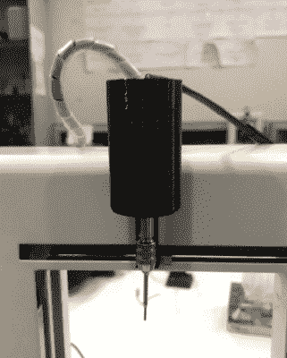

# 独特的 3D 打印机转向数控雕刻机

> 原文：<https://hackaday.com/2020/01/03/unique-3d-printer-turned-cnc-engraver/>

正如我们过去说过的，关于低成本桌面 3D 打印机的激增(除了我们在 Reddit 上看到的所有小船)，最令人兴奋的事情之一是，它们的运动控制系统已经成熟，可以重新利用。为廉价的 3D 打印机配备刮刀、笔筒，甚至固态激光模块，都是从这些机器中挤出更多功能的非常常见的方式。

但是由于他的打印机有点不寻常的性质，[【Hammad Nasir】能够把这个概念带得更远一点。由于比我们已经习惯的 99 美元的丙烯酸框架螺栓箱刚性大得多，他能够给它安装一个基本的主轴，并将其用于 CNC 雕刻。他不会在这台钻机上铣削任何钢铁，但从 Hackaday.io 页面上该项目的图片来看，它至少在将设计切割成塑料方面做了令人尊敬的工作。](https://hackaday.io/project/169125-hacking-old-3d-printer-into-cnc-machine)

【Hammad】为这个项目使用的 IdeaWerk 3D 打印机被过度建造。我们不知道设计者是否只是想让它看起来具有未来感和高科技(诚然，它看起来确实可以兼作电影道具)，或者他们认为它偶尔会被扔下楼梯。无论哪种情况，它都像一辆绝对的坦克。

虽然较小打印机的框架可能会在钻头开始在工件上移动时弯曲，但这东西不会移动。当然，这台机器可能仍然在运行标准的 GT2 带和 NEMA 17 排列，自从第一台木制机器诞生以来，这种排列一直被用于桌面 3D 打印机。因此，虽然框架可能准备接受一些惩罚，但一旦压力出现，驱动系统可能会恭敬地不同意。

IdeaWerk 上的轴和挤出机组件仅用一个螺栓安装在 X 轴上，这简化了改造。这使得设计替代工具支架变得异常容易，尽管可以说这里使用的 3D 打印电机支架[Hammad]是整个系统中的薄弱环节；如果它会在任何地方弯曲，它就会在那里。

如果你更倾向于摄影，你可能会对这个类似的简单项目感兴趣，这个项目看到[一个 2.5 W 的激光模块被固定在一台入门级 3D 打印机上](https://hackaday.com/2018/09/29/turn-a-cheap-3d-printer-into-a-cheap-laser-cutter/)。