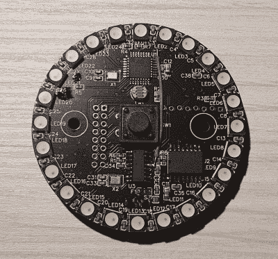

# 独特的时钟兼作开发板

> 原文：<https://hackaday.com/2021/09/18/unique-clock-doubles-as-a-development-board/>

如今，大多数钟表已经抛弃了圆形表盘，而是更喜欢通过 7 段显示来显示时间。[mihai.cuciuc]用他的计时装置 MakeTime 将圆脸带入数字时钟。

 MakeTime 有两个用途，第一个也是最明显的一个是作为时钟。MakeTime 不是用数字显示时间，而是通过点亮周边的 RGB LEDs 来显示分钟和小时“指针”的位置，从而回归圆形表盘时钟。通过使用 24 个 led，MakeTime 实现了 2.5 分钟的计时粒度。

第二个目的是作为开发平台。[mihai.cuciuc]在设计时钟时考虑到了黑客攻击，选择用许多人已经熟悉的组件来构建它，如 DS3231 RTC 和 WS2812 LEDs。为了使整个系统兼容 Arduino，微控制器是 AtMega 328P，可以通过 micro-USB 端口和 CH340 USB-UART IC 连接。如果 MakeTime 的寿命超过了时钟的寿命，328P 的所有未使用的 GPIO 将被分解到单个引脚接头，允许它在未来几年内重新用于其他项目。

似乎现在每个人都在制造自己独特的计时装置。看看用我们上周讨论过的安培计制作的[时钟](https://hackaday.com/2021/09/10/ic-clock-uses-ammeters-for-a-unique-time-telling-display/)。