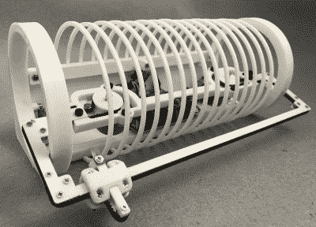

# 独特的时钟终于团结黑客和亮片

> 原文：<https://hackaday.com/2020/01/30/unique-clock-finally-unites-hackers-and-sequins/>

我们都见过双色亮片织物，你可以通过拖动手指来“画”上它，这样这些亮片就可以翻转到另一种颜色。玩起来很有趣，现在很受孩子们的欢迎，但如果你问我们这种材料是否有任何实际应用，我们会说没有。但那是在我们看到这个由[Ekaggrat Singh Kalsi]创造的智能时钟之前，他称之为亮片。

 由于时钟(至少是一个只显示小时和分钟的时钟)不需要很快刷新，【Ekaggrat】认为亮片材料可以作为显示器。当然，棘手的部分是弄清楚如何真正可靠地利用它。不能从后面做，而且由于亮片是塑料的，不能用磁铁。唯一的方法是用一个机器人“手指”和一些非常巧妙的运动学。

亮片最明显的特征是它的圆柱形的皮带传动。当连接到皮带的两个电机以相同的方向转动时，指针向左或向右移动。但是当马达转向相反的方向时，皮带上的张力迫使指针伸出并接触到亮片。它就像一个 H 型机器人，但是有着最短的 Y 轴。前杆通过设备内部的旋转环上下移动。一旦你在休息后观看它的运行视频，你可能会觉得更有意义。

[Ekaggrat]说这个项目是他寻求建造持续显示时间的“涂鸦钟”的一部分。使用亮片织物的优点是它不会因重复使用而损坏，[过去他一直试图通过光子手段解决这个问题](https://hackaday.com/2018/03/22/arduino-clock-jots-down-the-time-in-uv/)。

 [https://www.youtube.com/embed/6jpsiIsMG8U?version=3&rel=1&showsearch=0&showinfo=1&iv_load_policy=1&fs=1&hl=en-US&autohide=2&wmode=transparent](https://www.youtube.com/embed/6jpsiIsMG8U?version=3&rel=1&showsearch=0&showinfo=1&iv_load_policy=1&fs=1&hl=en-US&autohide=2&wmode=transparent)

