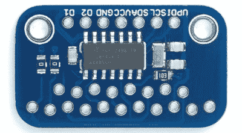

# 通用 TFT 显示器背包帮助小型显示器发光

> 原文：<https://hackaday.com/2022/06/04/universal-tft-display-backpack-helps-small-displays-shine/>

对于显示器和电视来说，TFT 技术可能是古老的新闻，但当涉及到业余爱好者的电子产品和嵌入式设备时，它仍然很活跃。由于[戴维·约翰逊-戴维斯]的[通用 TFT 显示背包](http://www.technoblogy.com/show?3JCM)设计，它们现在变得更加容易集成。

Breakout board, compatible with pinouts of most small TFT displays.

这种显示器价格低廉，容易获得，而且[David]注意到，在引出线和连接信息方面，许多显示器似乎有很多共同点。结果就是他的分线板设计，这是一个易于组装的小型 PCB 分线板，可以容纳您最喜欢的零售商或海外卖家提供的各种 TFT 显示器的引脚。

该板具有一些生活质量特性，如背光可选连接和交错引脚模式，以便不同的 TFT 板可以推入，无需焊接即可实现牢固连接。这对于测试和评估不同的显示器非常方便。

感兴趣吗？前往该项目的 [GitHub 库](https://github.com/technoblogy/universal-tft-display-backpack)，当你在那里时，看看【大卫】的[微型 TFT 图形库 2](http://www.technoblogy.com/show?3WAI) ，它是显示背包的自然补充。[大卫]确实知道他的东西，当谈到巧妙优化显示工作；我们喜欢他的解决方案[写入有机发光二极管显示器，而不需要 RAM 缓冲](https://hackaday.com/2018/11/01/drawing-on-an-oled-with-an-attiny85-no-ram-buffers-allowed/)。