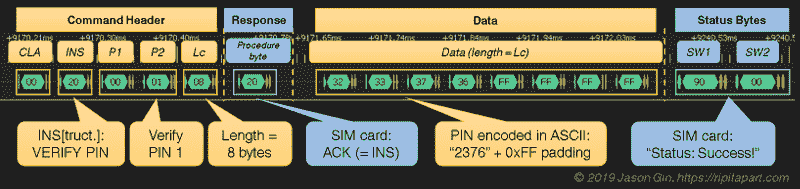

# 用逻辑分析仪解锁 SIM 卡

> 原文：<https://hackaday.com/2020/01/02/unlocking-sim-cards-with-a-logic-analyzer/>

[Jason Gin]想要重新使用他从美国电话电报公司获得的中兴 WF721 无线终端附带的 SIM 卡，但正如他所料，它被锁定到设备上。不幸的是，终端没有更改 PIN 的功能，他尝试的默认设置似乎都不起作用。剩下唯一要做的事情就是[打开它，用逻辑分析仪](https://ripitapart.com/2019/12/21/recovering-the-sim-card-pin-from-the-zte-wf721-cellular-home-phone/)嗅针。

这个项目是逆向工程的一个很好的例子，你甚至可以用一个便宜的逻辑分析仪和敏锐的眼睛来完成，但也完美地说明了一个事实，即物理访问设备在很大程度上否定了制造商试图实施的任何安全措施。[Jason]已经知道 SIM 解锁命令会是什么样子；他只需要捕获 WF721 和 SIM 卡之间的交换，找到正确的字节序列，并直接查看它后面的字节。

在 SIM 插槽的背面找到测试焊盘，他将 DSLogic Plus 逻辑分析仪连接到 VCC、CLK、RST 和 I/O 引脚，然后找到一个方便的地方连接地线。经过一番摆弄，他确定 SIM 卡运行在 4 MHz，因此他需要配置 250 kbit/s 的波特率来读取设备之间传递的 UART 消息。

一旦他找到了表示成功解锁的字节，他就能够逆向工作并确定解锁命令及其 PIN 码。事实证明，PIN 甚至是以明文形式通过网络发送的，[尽管如今处理安全问题的方式很常见](https://hackaday.com/2019/01/29/dont-toss-that-bulb-it-knows-your-password/)，但我们不能说这让我们感到惊讶。然后[杰森]要做的就是把 SIM 卡放进他的手机，并在提示时输入嗅探过的 PIN 码。

难道[Jason]只是跑到商店里买了一个预付费的 SIM 卡，而不是打开这个无线终端，用逻辑分析仪嗅它的通信？当然了。但是这有什么意思呢？