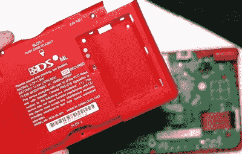

# 揭开一个不寻常的任天堂 DS 的身份

> 原文：<https://hackaday.com/2021/04/16/unmasking-the-identity-of-an-unusual-nintendo-ds/>

任天堂 DS 家族包含了一系列令人眼花缭乱的便携式游戏系统，这些系统是在 17 年间发布的。最初的 DS 获得了几次更新和特别版，当下一代 3DS 出现时，它产生了一系列全新的衍生产品。但即使在所有这些机器中，有一个名字甚至连马里奥自己都从未听说过:任天堂 DS ML。

在最近的一个视频中，[【复古未来】说他在中国购物网站淘宝上发现了这个售价约为 25 美元](https://www.youtube.com/watch?v=v3Ie-4Rom9w)的古怪系统，并买了一个以便近距离观察。从外观上看，该系统看起来有点像更新的 DS Lite，但它明显更大，屏幕看起来也很过时。这已经是对其真实身份的强烈暗示，正如其各种按钮和控件的位置一样。

Note the conspicuous absence of Nintendo’s name.

但直到[复古未来]破解了系统，他才能真正确认自己手上的东西。这是一个原始的任天堂 DS，可能是一个从未发行过的新的旧库存单位，它被移植到一个定制的外壳中，设计成看起来像后来升级的模型之一。至于这位卖家将这款 chimera 称为 DS ML 是什么意思，谁也说不准，尽管视频中的一位评论者认为“也许合法”听起来不错。

现在假设这些真的是全新的系统，只是简单地安装在新的情况下，25 美元可以说是一个很好的交易。只要你不关心玩最新的游戏。但与此同时，这也提醒人们，在与可疑的海外卖家打交道时，你付出的代价是值得的。很有可能，甚至更有可能，这些二手系统是为了赚快钱而翻新的。

假组件无处不在。事实上，大多数阅读这个网站的人很有可能在过去几年里收到了一些假零件，即使 T2 当时没有意识到。当夜间飞行公司愿意花 25 美元翻新一台近 20 年的任天堂掌上电脑时，你刚刚在易贝订购的那个 2 美元的温度传感器真的是博世制造的可能性有多大？

 [https://www.youtube.com/embed/v3Ie-4Rom9w?version=3&rel=1&showsearch=0&showinfo=1&iv_load_policy=1&fs=1&hl=en-US&autohide=2&wmode=transparent](https://www.youtube.com/embed/v3Ie-4Rom9w?version=3&rel=1&showsearch=0&showinfo=1&iv_load_policy=1&fs=1&hl=en-US&autohide=2&wmode=transparent)

