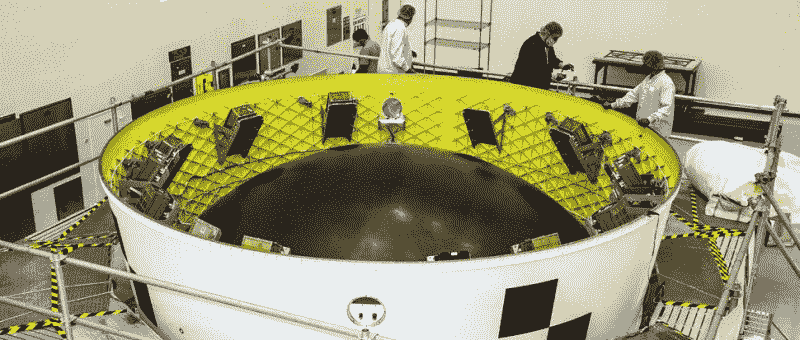
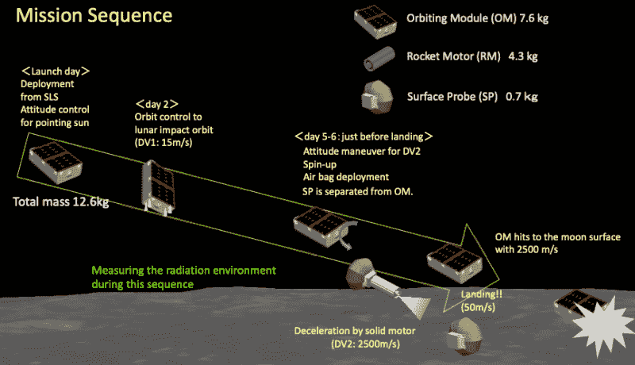

# 在阿耳忒弥斯一号上打开偷渡者科学号的包装

> 原文：<https://hackaday.com/2022/08/22/unpacking-the-stowaway-science-aboard-artemis-i/>

美国宇航局即将到来的 Artemis I 任务代表了航天局在月球上建立可持续人类存在道路上的一个重要里程碑。它不仅标志着大型空间发射系统(SLS)及其临时低温推进级(ICPS)的首次飞行，而且还将测试 25 吨猎户座多用途载人飞船(MPCV)在月球轨道上运行的能力。虽然这次飞行不会有任何船员，但它将作为阿尔特弥斯二号任务的彩排——自 1972 年阿波罗计划结束以来，人类将首次超越低地球轨道旅行。

由于 SLS 被设计用来提升一个满载和载人的猎户座太空舱，高耸的火箭和 ISP 在这次试飞中没有得到充分利用。由于有如此多的剩余有效载荷可用，Artemis I 处于独特的位置，能够在不改变整个任务或飞行轨迹的情况下将许多辅助有效载荷送入地月空间。

美国宇航局选择了 10 颗立方体卫星搭乘 Artemis I 号进入太空，该卫星将测试新技术并进行深空研究。这些二级有效载荷被官方视为“高风险、高回报”，它们的成功远非板上钉钉。但是如果他们完成了各自的任务，他们可能会帮助塑造月球探索的未来。

阿尔特弥斯一号可能还有几天就要发射了，让我们看看这些次要有效载荷中的一些，以及它们将如何部署，而不会危及将猎户座送上月球的主要任务。

## 飞行经济舱

最终，Artemis I 的目标是证明猎户座太空舱可以进入月球轨道，在月球附近导航和操纵，然后安全返回地球。如果这次试验失败，无疑会推迟未来的阿耳忒弥斯任务，甚至会危及人类登陆的计划。对于美国宇航局的长期目标来说，这次任务的成功绝对至关重要。

这个立方体卫星无论如何也不会成为美国宇航局或任务控制中心的优先任务。虽然每个人都希望看到他们成功，但不会对这些工艺给予特殊待遇或考虑。如果需要做出一个以牺牲二级有效载荷为代价来拯救猎户座的决定，毫无疑问它会走哪条路。

为了防止与主要任务发生任何可能的相互作用，立方体卫星甚至不会在猎户座与 ICPS 分离近两个小时后部署。一旦胶囊移动到安全距离之外，小卫星将从安装在工作台适配器内部的倾斜分配器中顺序释放。

级适配器包括一个专用的航空电子设备包，它与主要的任务电子设备相隔离，并负责确定每个弹簧加载分配器何时激活和推出其各自的立方体卫星。提供了一条电源总线来为立方体卫星中使用的 18560 个电池充电，但为了安全起见，它也与 SLS 自己的电气系统隔离。

不幸的是，这意味着立方体卫星最后一次充电是在 2021 年 10 月猎户座飞船被安装到车辆装配大楼(VAB)的适配器之前。使事情更加复杂的是，每个单独飞行器的状态目前都是未知的，因为美国宇航局要求卫星在从级适配器释放后 15 秒前关闭电源。

在放置了近一年后，一些卫星的电池很有可能已经耗尽。在这种情况下，飞船上的光伏电池将有望在部署后为其充电。如果不是…至少太空之旅是免费的。

 [https://www.youtube.com/embed/fOhyZEIhZ78?version=3&rel=1&showsearch=0&showinfo=1&iv_load_policy=1&fs=1&hl=en-US&autohide=2&wmode=transparent](https://www.youtube.com/embed/fOhyZEIhZ78?version=3&rel=1&showsearch=0&showinfo=1&iv_load_policy=1&fs=1&hl=en-US&autohide=2&wmode=transparent)

## 值得冒险的研究

乘坐未经测试的火箭前往太空已经足够危险，但当你在原型火箭上作为第二有效载荷飞行卫星，甚至不知道电池是否充电时，这真的是孤注一掷。鉴于这种可能性，你可能会认为立方体卫星的任务过于简单——毕竟，研究人员为什么要将宝贵的时间和材料投入到这样一个不确定的命题中呢？但这忽略了千载难逢的免费月球之旅的诱惑。

碰巧的是，在这些二级有效载荷分配器中塞进了一些非常有趣的科学，其中几个实验代表了第一个此类实验。以下是其中的几个亮点:

### 奥莫特纳希

也许最雄心勃勃的二级有效载荷任务是由日本宇宙航空研究开发机构(JAXA)建造的由日本宇宙航空研究开发机构(日本宇宙航空研究开发机构)展示的探索技术(T4)和电磁干扰技术(日本宇宙航空研究开发机构)。这个立方体卫星将跟随猎户座一路到达月球，并使用其推进器将自己置于与月球表面碰撞的路线上。当机载雷达确定它处于适当的高度时，一个固体火箭发动机将点燃以减速着陆舱，然后着陆舱将自由降落到大约 100 米(328 英尺)的表面。就在着陆前，一个 50 厘米(1.6 英尺)的安全气囊将充气缓冲冲击力。

如果一切按计划进行，OMOTENASHI(在日语中翻译为“欢迎”或“好客”)将是迄今为止最小的在月球表面可控着陆的车辆。虽然这项任务主要是为了测试着陆技术，但着陆器上确实有一个加速计和超高频发射器，如果这个 0.7 公斤(1.5 磅)的飞行器在与月球风化层的近距离接触中幸存下来，它有望返回有用的数据。

有趣的是，OMOTENASHI 背后的团队已经向社区发出挑战，要求他们在飞往月球的过程中以及在月球表面着陆后检测其遥测信号。万一任何 Hackaday 的读者设法拿起它，[我们很乐意听到它](https://hackaday.com/submit-a-tip/)。

### 阿尔戈蒙

意大利的 ArgoMoon 任务将展示立方体卫星在接近另一个航天器时的必要技术，[使用 ICPS 本身作为目标](https://digitalcommons.usu.edu/smallsat/2020/all2020/43/)。一旦分配，卫星将与 ICPS 紧密编队飞行，并将使用其机载相机为历史目的拍摄 SLS 上面级。

由于 ArgoMoon 计划成为首批释放的次级有效载荷之一，它还将有机会记录其他几颗立方体卫星的部署情况。由于分配器的仪器有限，来自飞船的图像将用于确定是否所有的卫星都已成功部署。

最终，ArgoMoon 将使用其机载推进器远离 ICPS，并将自己置于地球上方的高空轨道。在接下来的几个月里，飞船将暴露在深空环境中，传统上立方体卫星通过留在地球磁场的范围内来避免这种情况。这段时间将用来[验证由 ArgoMoon 的制造商 Argotec 开发的抗辐射组件](https://hackaday.com/2022/02/10/remoticon-2021-sergiy-nesterenko-keeps-hardware-running-through-lightning-and-cosmic-rays/)。

### NEA 童子军

当猎户座和几个次要有效载荷前往月球时，NEA 侦察兵将为不同的目标设定路线:2020 GE，一颗直径小于 18 米(60 英尺)的近地小行星(NEA)。虽然立方体卫星有推进器来确定自己的方向，但它的主要推进手段将是一个 86 平方米(925 平方英尺)的太阳帆。它将在四个可延伸的吊杆之间展开，使用的机制[来自行星协会的光帆飞船](https://hackaday.com/2019/06/24/small-lightsail-will-propel-cubesat/)中使用的机制。

 经过一次月球引力辅助，“NEA 侦察兵”将于 2023 年末按计划拦截 2020 GE。该飞行器将到达距离小行星 1.6 公里(1 英里)的范围内，并执行任务规划者认为将是太空探索历史上最慢的飞越，以每秒 30 米(100 英尺)的相对速度通过它。这将使 NEA 侦察兵有几个小时的时间用相机和传感器对小行星进行成像，这是第一次从自由飞行的航天器上直接观察到如此小的物体。

该任务不仅是太阳帆技术发展的又一重要步骤，而且从 2020 GE 收集的数据将有助于为未来的行星防御系统提供信息。目前，科学家们不知道这种规模的近地小行星实际上是固体物体还是松散的小岩石和尘埃，希望这项近距离研究的结果将允许科学家们在必要时提出摧毁或偏转类似物体的计划。

## 一本历史书

虽然它们可能在规模和复杂性上有所不同，但 Artemis I 上的所有辅助有效载荷都承诺将带来激动人心的新科学。亚利桑那州立大学开发的[LunaH-Map 将试图绘制月球表面水沉积的详细地图，这对未来人类的探索大有裨益。BioSentinel 将是第一个在低地球轨道](https://lunahmap.asu.edu/)之外进行的[长期生物学研究，并将研究空间辐射对 DNA 的影响。从列表中选择任何一个任务，你会发现自己掉进了一个迷人的兔子洞。](https://www.nasa.gov/centers/ames/engineering/projects/biosentinel.html)

多年来，关于太空发射系统的巨大成本已经说了很多，该系统已经开发了十多年。许多人认为这是“旧太空”心态的遗留物，SpaceX 和蓝色起源[新的更灵活的火箭将使它在飞行几次之前就过时了。只有时间才能证明这些批评是否正确，但这次首次飞行令人难以置信的科学潜力似乎清楚地表明，至少美国宇航局打算让他们的钱花在他们全新的巨型火箭上。](https://hackaday.com/2021/02/12/europa-decision-delivers-crushing-blow-to-nasas-space-launch-system-sls/)