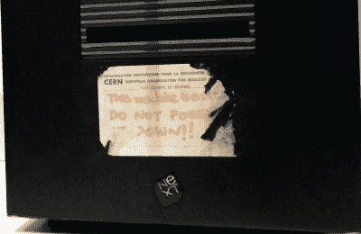
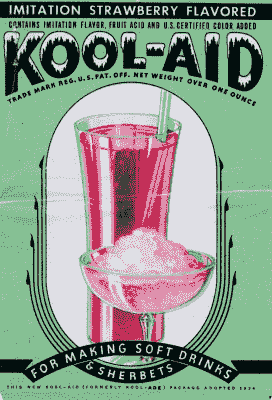

# 揭开 Web 3 的神秘面纱，技术是什么？

> 原文：<https://hackaday.com/2022/01/20/unpicking-the-hype-around-web-3-whats-the-tech/>

在科技媒体泡沫较多的领域，时下的流行词是不可避免的:“Web 3”。这是使用区块链技术的新一代去中心化在线应用的统称，它是继 2000 年代中期围绕所谓“Web 2”网站的类似兴奋之后出现的，这些网站脱离了早期互联网的静态页面。

在 Web 3 上阅读很明显，谈论下一个大事件涉及大量的炒作。如果这是 4 月 1 日，写一篇很长的报道会很有吸引力，但在 1 月这是不行的。相反，现在是时候从技术的角度来审视 Web 3 了。当然，一个 Web 3 应用程序使用了区块链技术，经常被气喘吁吁地报道为“区块链”，就好像只有一个一样，但是如何使用呢？这一切背后真正的技术是什么？

## 这些 Web 3 的东西到底是从哪里来的？

“This machine is a server. DO NOT POWER IT DOWN!!” Tim Berners-Lee’s famous sticker on the front of his NeXTcube, the first web server. Binary Koala [CC BY-SA 2.0](https://commons.wikimedia.org/wiki/File:This_Machine_is_a_server_DO_NOT_POWER_IT_DOWN!!_-_London_Science_Museum,_2015-03-19_(by_Binary_Koala).jpg).

在早期，网络只能在学术界找到，从欧洲粒子物理研究所的蒂姆·伯纳斯·李，然后从其他地方，如伊利诺伊大学的国家超级计算应用中心。在 20 世纪 90 年代中期，绝大多数网站都是由 NCSA 的 HTTPD 服务器软件提供服务的，这是后来非常流行的 Apache 项目的基础。这个时代的网站后来被称为 Web 1.0，作为静态 HTML 页面运行，只能通过重新加载页面来刷新。

千禧年给我们带来了 Web 2.0。这通常被认为是指利用用户生成内容的更加巧妙的一代网站。每一次这样的时代转变背后都有一项新技术，如果是 Web 1.0 的 HTTP 服务器，那就是在浏览器中使用 Javascript 来动态刷新 Web 2.0 的页面内容。这被称为 AJAX，代表异步 Javascript 和 XML，虽然数据传输现在更可能是 JSON 而不是 XML，但它仍然是今天的网站模糊网页和应用程序之间的界限的方式。

From Web servers to crypto miners, a rack of mining rigs in a crypto farm. Marco Krohn, [CC BY-SA 4.0](https://commons.wikimedia.org/wiki/File:Cryptocurrency_Mining_Farm.jpg).

所以我们来到了 Web 3，这里我们有一个问题，当它涉及到理解所有的技术。区块链技术是其根本所在，但关于这是如何发生的却鲜有提及。我们被告知，这将分散数据的持有，就像脸书或 Twitter 等传统的单一网络应用提供商所做的那样，他们将所有东西都存储在自己的服务器上，而新的 Web 3 提供商则通过所谓的分散自治组织在分布式区块链上存储数据。对区块链的处理将产生一种数字货币，这将为通过处理区块链来保持应用程序运行的采矿者提供货币激励，并可能为 DAO 的所有者带来可观的利润。

## 我们需要的不仅仅是“它使用了区块链”。

正是在最后一句话中，我们发现了 Web 3 所描述的问题，因为尽管毫无疑问有在线应用程序可以使用区块链进行存储，但加密货币的加入给它洒上了精灵尘，真实的故事被一群在他们的视觉中嗡嗡作响的小比特币符号的人的大肆宣传所掩盖。一切都成为 Web 3 DAO 的潜在载体，即使没有什么信息表明这会带来什么好处。

Is a metaphorical glass of this stuff necessary to understand what’s going on? MissouriStateArchives, [Public domain](https://commons.wikimedia.org/wiki/File:Historic_Trademarks_-_Kool-Aid.jpg).

当然，虽然对于那些喝了足够多的 Kool-Aid 的人来说，很明显所有目前运营的网站都应该立即转移到区块链，但很难看出这对像 Hackaday 这样的网站有什么好处。

不过，再深入一点，我们会遇到智能合约。智能契约是一段代码，一旦制定，只有在存在一组定义的条件时才会执行。它们被构建到一些区块链实现的结构中，因为以太坊是一个众所周知的例子，所以它是支撑五月 Web 3 提议的区块链。

举一个非常简单的例子，Alice 可能以 1 CryptoUnit 的价格向 Bob 出售一件商品，并在商品交付时支付，然后将交易编码为智能合同，该合同在 CryptoUnit 区块链的块中形成一个条目。当 Bob 收到物品时，他放置一个新的条目，说明这一点，并在先前的条目中指定合同，在挖掘包含新条目的块时，执行代码，并将所需的金额自动转移给 Alice。

如果你认为 Alice 和 Bob 的例子有点做作，那你当然是对的，但是在现实世界中有很多地方，目前通过私人持有的集中服务在线完成的交易可能会使用区块链以这种方式完成。例如，一旦一项活动获得资金，众筹网站或许可以使用智能合同来触发支付。

## 只是因为你能，是吗？

因此，我们试图找到 Web 3 的技术所在，并提出了一些建议。现在的问题不是什么应用程序可以放在区块链上，而是这些应用程序是否真的应该放在 T1 上。这是一个将由众多 Web 3 创业公司来回答的问题，但我们预计这个过程不会一帆风顺。

区块链处理过程中的能源消耗问题将不会被证明是容易绕过的，那些将成为攻击媒介的全新领域的脆弱性问题也不会被证明是容易绕过的。然后有一个有趣的前景，一个经常使用的区块链最终会发展到这样一个地步，当使用它来支撑应用程序时，它的笨拙会带来它自己的问题。

在撰写本文时，以太坊区块链的规模仍然(仅仅)以数百千兆字节来衡量，但是当它不可避免地达到数百兆字节，甚至数千兆字节时，在处理智能合同时将面临什么挑战？即便如此，抛开技术上的担忧，还有一个永恒的问题:当市场波动意味着加密货币跌至矿工无利可图的地步时，这对区块链的服务意味着什么？

很明显，尽管 Web 3 的技术基础确实存在，尽管有时有铺天盖地的宣传，但从最终用户的角度来看，它们的直接好处并不像 AJAX 对于 Web 2 那样清晰。我们不想让这个想法胎死腹中，但我们也不准备长期依赖这种饮料。作为未来几年的观察者，看看现实世界中使用该技术的服务是什么样的，将会很有趣。