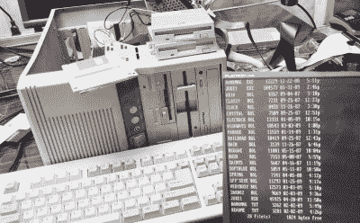

# 使用 8 倍软驱控制器近距离接触个人

> 原文：<https://hackaday.com/2022/07/25/up-close-and-personal-with-an-8x-floppy-controller/>

他正在开发的 286 需要一个软驱控制器，[Gadget Reboot]去 GitHub 看看开放硬件领域有什么可用的。在那里，他发现了一个能够控制多达八个驱动器的 ISA 板，来自谢尔盖·基舍列夫，被称为怪物软盘控制器(FDC)——可以说对这项任务来说有点过了，但太令人印象深刻了，不能错过。幸运的是，他决定[在视频](https://www.youtube.com/watch?v=fZdekwbet6g)中记录构建过程，涵盖从订购主板到配置 BIOS 的所有内容。

Testing with four drives.

视频从原理图的高度概述开始，您可能已经猜到，原理图实际上是将两个相同的软盘控制器放在同一块板上。你可以看出这种设计是在当前芯片短缺的情况下完成的，因为[Sergey]小心翼翼地留出了一些回旋的余地，如果某些零件变得不可用，必须用 BOM 中列出的替代产品替换。这个决定已经为[小工具重启]带来了回报，因为在某些情况下，他不得不选择第二选择 IC。

当[Gadget Reboot]提交电路板进行制造时，他感到有些惊讶，因为选择 edge 连接器上的黄金触点使生产成本从 5 美元飙升至近 300 美元。他详细说明了他是如何将成本降低一点的，但最终还是比底价贵了 10 倍多。

视频的后半部分专门介绍如何配置庞大的 FDC，对于希望将该板用于自己系统的人来说，这无疑是一个有用的资源。[Gadget Reboot]演示了使用“只有”四个软驱的主板，一切看起来都很好。

当然，如果你的需求不是很大，[我们已经看到了一些更方便的软盘控制器](https://hackaday.com/2021/03/30/a-floppy-controller-for-the-raspberry-pi/)，它们可能更接近你正在寻找的东西。

 [https://www.youtube.com/embed/fZdekwbet6g?version=3&rel=1&showsearch=0&showinfo=1&iv_load_policy=1&fs=1&hl=en-US&autohide=2&wmode=transparent](https://www.youtube.com/embed/fZdekwbet6g?version=3&rel=1&showsearch=0&showinfo=1&iv_load_policy=1&fs=1&hl=en-US&autohide=2&wmode=transparent)

感谢[AnotherMaker]的提示。