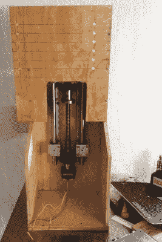

# 近距离接触独特的 3D 打印机套件

> 原文：<https://hackaday.com/2021/09/21/up-close-and-personal-with-an-unusual-3d-printer-kit/>

虽然仍然有很多人在摆弄定制的 3D 打印机，但可以肯定的是，如今大多数人都在使用商用机器。现在价格太低了，即使是树脂打印机，除非你有一些要求严格规格的应用程序，否则摆弄一台自制机器是没有意义的。

碰巧的是，[【Nicolas tran chant】其实也确实有这样的应用](https://vivalatina-shop.com/blogs/custom-made-jewelry/3d-printer-test-and-review)。他的珠宝公司需要超高分辨率的 3D 打印，但即使是为牙科工作设计的昂贵打印机也没有给他想要的结果。与其花五位数的钱买一台可能完成工作也可能无法完成工作的机器，他决定去看看有什么样的工具箱。就在那时，他发现了[弗雷德里克·劳特雷]的作品。

A look at the heavy-duty Z axis.

早在 2017 年，他就从他那里购买了独特的“自上而下”SLA 套件，现在，在使用该机器四年后，[Nicolas]决定与班上的其他人分享他的经验。这种打印机的基本思想是光源在树脂桶的上方，而不是下方。因此，在每一个新的层上，印刷床不是被拉得离树脂更远，而是更深地沉入树脂中。

[与爱好者更常见的“自下而上”式树脂打印机](https://hackaday.com/2020/02/14/200-resin-printer-reviewed/)相比，这种方法不需要在水箱底部贴一层不粘薄膜。因此，印刷变得更快、更可靠，因为不需要为每个新层从薄膜上剥离零件。

[Nicolas]详细介绍了构建和使用 700 美元套件的细节，包括他偶尔做的修改。听起来该工具包后来经历了一些修改，但核心概念基本上是相同的。值得注意的是，套件*并没有与实际的投影仪一起提供，所以在他的案例中，总成本接近 1400 美元。我们还惊讶地看到[Frédéric]显然是自己开发了这台打印机的软件，因此关于如何争论其不熟悉的切片和支持生成界面的提示可能会特别有帮助。*

不幸的是，听起来似乎[弗雷德里克]已经消失了。工具包的网站已经不在了，[尼古拉斯]也无法与他取得联系。这是一个遗憾，因为这看起来是一个迷人的项目。也许 Hackaday 社区可以帮助追踪这位神秘的 SLA 大师？