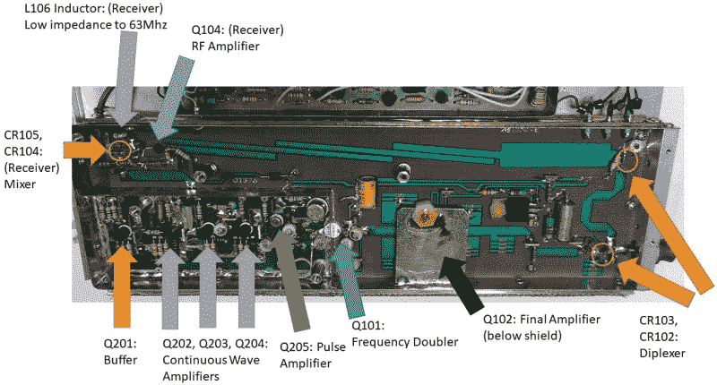

# 近距离接触一些损坏的航空电子设备

> 原文：<https://hackaday.com/2021/07/10/up-close-and-personal-with-some-busted-avionics/>

当他发现这个坏了的 Narco DME 890 被扔进垃圾桶时，[Yeo Kheng Meng]做了任何一个有自尊的硬件黑客都会做的事情:[他把它带回他的工作台，这样他就可以把它砸开](https://yeokhengmeng.com/2021/07/dme-theory-and-teardown-of-narco-dme-890/)。毕竟，你很少能看到一项按照甚至过时的航空电子设备所要求的严格标准建造的技术。

DME 代表“距离测量设备”，正如你可能从名称中所料，它指示飞机离给定目标有多远。[Yeo Kheng Meng]实际上在他的文章中深入探讨了它如何工作的理论，如果你对所有细节感兴趣的话，但简短的版本是，飞行员选择地面上一个已知站的频率，到目标的距离显示在屏幕上。

在这个装置里，[Yeo Kheng Meng]发现了几块密密麻麻的电路板，每块电路板都是相互隔离的，以尽量减少干扰。主 PCB 是 Mostek MK3870 微控制器的主机，这是一个 8 位芯片，以 4 MHz 的频率工作，并提供 128 字节的 RAM。对于现代 AVR 牧马人来说，这听起来不太像，但对于 1977 年来说，这是最前沿的东西。

进一步挖掘，[Yeo Kheng Meng]打开了装有发射器和接收器的金属罐。多亏了该设备的优秀文档，其中包含大量原理图和框图，他能够确定许多组件的功能。即使你不太可能接触到这种技术，看到对硬件看似平凡的细节的思考和关注也是令人着迷的。

渴望更多适航工程？我们已经仔细观察了从民用客机上取下的一些硬件，以及一些久经沙场的电子设备，这些电子设备曾经是 AH-64 阿帕奇攻击直升机驾驶舱的装饰,[。](https://hackaday.com/2018/04/30/milspec-teardown-ah-64a-apache-data-entry-panel/)