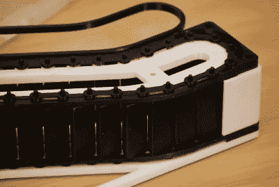

# 用这个 3D 打印的自动扶梯来玩桌面玩具游戏

> 原文：<https://hackaday.com/2022/08/09/up-your-desk-toy-game-with-this-3d-printed-escalator/>

让我们现实一点，没有人*需要*一个微型电动扶梯放在他们的办公桌上。但是现在你看到了，你真的能说你不想要一个自己的吗？[的设计来自【阿列克谢】](https://www.printables.com/model/190972-motorized-mini-desktop-esc)，实际上是之前发布的[手动版本的逻辑演变。但考虑到我们的资金(和 3D 打印时间)，我们肯定会选择这种新的电动变体。](https://www.printables.com/model/165271-mini-desktop-escalator)

 虽然核心机制大体相同，但动力单元使用 N20 齿轮电机和 18650 电池。这里没有花哨的电机控制器——只需扳动开关，你就能获得相当于每分钟 30 转的踏步动作。当你用完电池时，你会的，有一个板载 TP4056 充电模块来保持好时光滚动。

[AlexY]还没有机会记录电动版本自动扶梯的构建过程，但由于大多数部件都与手动版本兼容，您应该能够通过参考早期的组装指南来解决这个问题。

热喷塑料不是你的菜？我们以前见过一种木制自动扶梯，它可以让苗条的人一直运动，直到你意识到你可以把你的技能用在更有建设性的事情上。

 [https://www.youtube.com/embed/d-7QTrCJvpQ?version=3&rel=1&showsearch=0&showinfo=1&iv_load_policy=1&fs=1&hl=en-US&autohide=2&wmode=transparent](https://www.youtube.com/embed/d-7QTrCJvpQ?version=3&rel=1&showsearch=0&showinfo=1&iv_load_policy=1&fs=1&hl=en-US&autohide=2&wmode=transparent)

感谢[Abe]的提示。