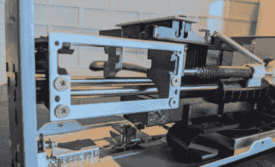

# 升级的胶片扫描仪可以免费处理更大的格式

> 原文：<https://hackaday.com/2022/07/30/upgraded-film-scanner-handles-bigger-formats-at-no-cost/>

胶片扫描仪是将幻灯片和底片数字化的有用工具，而[Christian Chapman]拥有的 Plustek 8100 也可以，但仅限于小格式胶片。他没有花钱买一台可以处理 120 张胶片的昂贵得多的中画幅扫描仪，而是改装了他的 8100，通过结合良好的旧软件和硬件篡改来完成同样的事情。

 在软件方面，【克里斯蒂安】[为 Plustek 8100 修改了一个驱动](https://github.com/enthdegree/sane-backends)，使其扫描扫描头的距离比平时更远。在应用程序级别，为了扫描中等格式的帧，它总共进行四次扫描:每个象限一次。结果通过一个精心设计的 shell 脚本在软件中缝合在一起，该脚本提供预览、处理故障并优雅地重启。

硬件方面，扫描架需要修改，以确保当扫描头比最初设计的移动得更远时，没有任何东西会干扰扫描头。一些 CAD 和 3D 打印很快就完成了这个任务。顺便说一句，这个硬件模块很好地展示了[3D 打印的核心优势之一](https://hackaday.com/2020/11/16/3d-printering-the-things-printers-dont-do/):制造几何形状简单的物体的能力，然而用任何其他方式建造都很麻烦或不切实际。