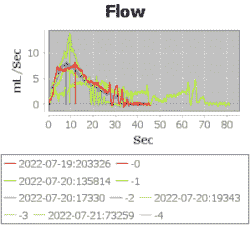

# 通过尿流实现尿流测量

> 原文：<https://hackaday.com/2022/09/29/urine-flow-measurement-made-accessible-with-uroflow/>

如果你正在应对一种慢性疾病，持续监控你的症状的能力是必不可少的，这有助于你获得关于是什么让你的身体运转——或者更确切地说，是运转不良——的宝贵见解。然而，对于许多疾病，你需要专门的设备来监测它们，而且往往是你只能偶尔去看医生。幸运的是，我们黑客可以自己想办法监控我们的情况。对于一种称为 BPH(良性前列腺增生)的疾病，监测它的方法之一是测量尿流率。能够在家里进行这些测量提供了更好的见解，而且，在发现流速测量设备甚至租金都贵得令人望而却步后，[Jerry Smith] [开始建造自己的设备。](https://hackaday.io/project/187418-uro-flow)

这种构建真正被设计成对于需要这样一种设备的任何人都是可复制的。Jerry 详细记录了该项目及其内部运作—[这份 31 页的文件](https://github.com/jerrygeo/uFlow/blob/main/Uroflow.pdf)包含完整的构建说明、订购 BOM、PCB 描述和引脚排列图、校准和验证说明，甚至软件流程图；[GitHub repo](https://github.com/jerrygeo/uflow)拥有你可能需要的一切。我们感到惊喜——如此大量的文档在黑客项目中并不常见，考虑到这是一种医疗设备，其他有需要的黑客会想要复制它，这就更有价值了。

对于硬件，[Jerry]采用了某型号的小型数字秤，并使用 HX711 放大器重新使用了其基于称重传感器的称重机制，替换了屏幕并增加了一个额外的控制电子设备箱。Arduino MKR1010 作为操作的大脑，硬件记录流量数据，最初记录在 SD 卡上，通过 WiFi 连接将数据传输到计算机进行绘图；DS3234 RTC 分线点有助于跟踪时间，定制 PCB 将所有这些联系在一起。所有这些东西都很容易放在一起，这在很大程度上是因为提供了大量的说明。

如果这个话题感觉很熟悉，那是因为几年前我们已经介绍过[一种用途相同的不同设备](https://hackaday.com/2018/04/01/assess-your-output-with-a-cheap-diy-urine-flowmeter/)。当涉及到医疗设备时，看到黑客自己解决问题是令人喜爱的。这不仅仅是价格的问题，通常还有质量的问题——在很多国家，医疗技术的可用性都是一个问题，而[开源技术可以在这些地方产生巨大的影响。](https://hackaday.com/2018/01/30/making-the-case-for-open-source-medical-devices/)即使在技术先进的国家，当谈到个人使用的医疗技术时，也有很大的差距——例如，我们已经看到黑客们为糖尿病管理建立人工胰腺解决方案的[努力](https://hackaday.com/2017/12/06/woman-gets-diabetes-builds-own-pancreas/)接[努力](https://hackaday.com/2018/08/09/homebrew-pancreas-gets-30-minutes-of-fame/)，这个问题早就[需要该领域的公司解决](https://hackaday.com/2014/07/13/open-source-glucose-monitoring-an-the-front-lines-of-innovation/)。对于我们这些没有慢性病的人来说，监测我们的健康仍然有好处——[黑掉现有的健身追踪器](https://hackaday.com/2018/05/04/hacked-fitness-trackers-aim-to-improve-mental-and-physical-health/)或[建立我们自己的](https://hackaday.com/2022/04/03/tshwatch-helps-you-learn-more-about-yourself/)来更多地了解我们的身体如何运作。