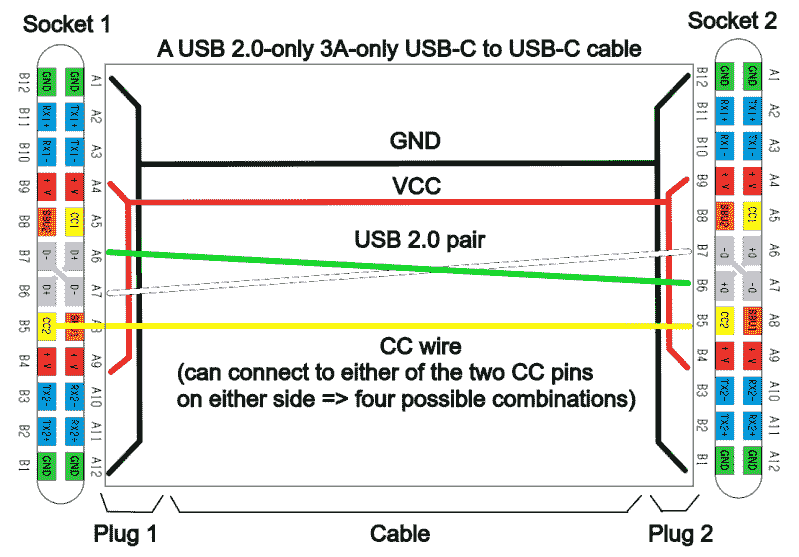
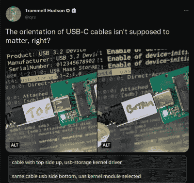
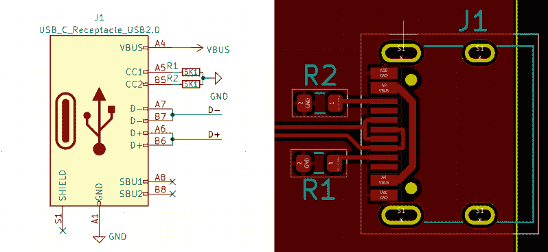
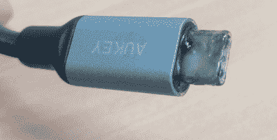

# 关于 USB-C 的一切:黑客入门

> 原文：<https://hackaday.com/2022/12/06/usb-c-introduction-for-hackers/>

我们的设备中已经有至少五年的 USB-C 端口了。是很多厂商和黑客都能背后搞定的标准。最初，对于我们在那里实际会遇到什么，有很多困惑，制造商引起的偏差已经让一些人却步。然而，USB-C 已经存在，我想向您展示 USB-C 实际上是如何使用的，作为一个超级用户，您可以从它那里得到什么，作为一个业余爱好者，您可以从它那里得到什么。

现代设备有一系列共同需求——它们需要电源输入或电源输出，有时两者都需要，通常是 USB2 连接，通常还需要一些更高速的连接，如显示器输出/输入或 USB 3。USB-C 是一个接口，旨在能够照顾所有这些。前面提到的一切都是可选的，这是一种祝福也是一种诅咒，但是你可以很快学会根据一个设备的外观来区分它会带来什么；如果有任何疑问，我会告诉你如何检查。

## 交流能力、配置和注意事项

我们都知道 USB-C 可以旋转——它允许您将电缆插入任何方向——这是对 USB-B 的重大改进。让我们来看看它是如何工作的。为了实现这一点，有一个 CC(配置通道)连接——每根 USB-C 电缆中的一根单线连接到 Type-C 连接器中的两个 CC 引脚之一，这对于 USB-C 的工作至关重要。对于简单的 USB-C 用例，如“从一个端口获得 USB 2.0 和 5 V，遵循一个简单的方法——将一个 5.1kω下拉电阻连接到每个 CC 引脚，您将拥有一个 USB-C 端口，可用于所有合理的设备。

当然，USB-C 支持 5 V 和 USB 2.0 以外的东西。你可以从 USB-C 端口获得各种电压，这对于给笔记本电脑等设备充电来说非常方便。你可以得到 USB 3，DisplayPort，和 Thunderbolt。大多数笔记本电脑都允许您尽可能利用 USB-C 连接坞站，为您提供高分辨率显示屏、大量 USB 端口，并通过同一根电缆充电。这是怎么做到的呢？

对于电压大于 5 V (USB-PD)或 USB 2 和 3 以外的高速连接(交替模式)等用例，您必须通过相同的 CC 连接调用它们。你有一根单线用于双向通信，这使得 CC 线成为半双工信道；这是一种类似以太网的固定速率 300 kbps 协议。有大量的 IC 使用该协议来实现一组定义的功能，并且相当多的 IC 和微控制器外设将帮助您通过该协议说出您想要的任何内容。

## 以巨大的力量…

USB-C 端口有四个高速差分对的引脚，总共八个引脚。许多简单的 USB-C 设备都将其断开，但这些端口有很大的功率。首先，当你在笔记本电脑上看到这样的端口时，你通常可以从它们中获得 USB 3.1 或 3.2。一个 USB3 端口通常占用四个差分对中的两个，但一些设备支持 2 x 2 USB3 链路，使对的数量和传输速度加倍。越来越多的时候，你也可以从 USB-C 端口获得 DisplayPort 无论是两个还是四个通道，你都可以驱动一些非常高分辨率的显示器。

然后，还有 Thunderbolt，这是一种半专有技术，也使用 USB-C 连接器上的高速线对。它可以在自身内部隧道传输 USB3、DisplayPort 甚至 PCIe，尽管它不是这三样东西中的任何一个。有了 Thunderbolt，你可以拥有一个坞站，但需要更多的 DisplayPort 选项，更好更快的端口，甚至可能是一个外部 GPU！你可能会猜测这是所有这些中最稀有和最昂贵的选择。

鉴于这些高速和高功率的能力，将一切整合到一个连接器中具有强大的优势。你的 USB-C 笔记本充电器也可以在需要的时候给你的手机充电，由于积极的标准化，充电不再涉及太多专有的东西。

如果你有一个 USB-C 任天堂 Switch 坞站，理论上它也可以作为你的笔记本电脑的坞站，假设你可以机械地让它连接，笔记本电脑坞站将与你的 Steam Deck 一起工作。总的来说，扩展坞变得越来越合理——你可以用一根电缆做任何事情，它可以与大多数 USB-C 设备一起工作，就是这样。

每年，USB-C 做不到的事情越来越少。[去年，他们发布了 EPR](https://hackaday.com/2021/09/16/powering-up-with-usb-untangling-the-usb-power-delivery-standards/) ，将 USB-C 端口容量提高到 240 W，48V @ 5a——与 SPR 相反，SPR 将 USB-C 端口限制在 100 W，20 V @ 5 A。这基本上消除了笔记本电脑上对筒状插头适配器的需求，过去 100 W 的 USB-C 是一个障碍——我们不再需要所有带各种筒状插孔适配器的“通用”电源。然后，还有 USB4，一个即将到来的标准，就像 Thunderbolt 一样，但不完全是，但更好，但更差？无论哪种方式，我们都将在计算机中看到更多的 USB4 支持，希望有一天每台笔记本电脑都配备高速接口，即使是最便宜的。

总的来说，USB-C 有一个光明的未来，它在许多方面都设计得相当好——从我们几十年来在端口、电缆和标准方面犯下的错误中学习，并为即将到来的添加留下足够的空间。

当然，USB-C 也创造了一个全新的出错领域。

## …创造了令人难忘的成绩记录

USB-C 的恐怖故事无处不在——基本上每个使用过 USB-C 的人都可以告诉你，USB-C 有一次失败了，或者可能失败了多次。USB-C 的优点比缺点多，但我坚信我们应该记住它过去让我们失败的方式，以及现在仍然让我们失败的方式，这样我们就可以从这些方式中学习，并找出如何避免它们。

并不是 USB-C 标准的所有部分都是经过深思熟虑的。首先想到的是电缆和端口的情况。当你看到一个 USB-C 端口时，你很难一眼就知道它支持什么，电缆也是如此。目前的情况非常糟糕——对于一个还没有找到合理解释的人来说，使用 USB-C 有时需要大量的猜测。对于如何区分电缆，有一些指导原则，我将在此过程中展示一些技巧。也就是说，他们应该从一开始就引入引人注目的视觉标记方案。

USB-C 标准实现起来有些复杂，涉及到许多状态机和特性。USB-C 规范[以冗长的 PDF 文档](https://twitter.com/whitequark/status/1035760558237204480)而闻名:连接器和电缆文档长达 350 页，USB-PD 文档长达 600 多页。多年来，许多制造商真诚地尝试，仍然创造出具有明显和奇怪边缘外壳的设备。只能与特定充电器配合使用的笔记本电脑，反之亦然，只能与特定笔记本电脑配合使用或只能与特定充电器结合使用的坞站，只能在一个方向上工作的电缆，或者根据电缆方向不同而工作不同的[设备](https://twitter.com/qrs/status/1429764605807636483)——其中不乏奥秘。

除此之外，还有无数种误用 USB-C 的方法，某些制造商也在努力尝试！其他人滥用 USB-C 标准不是 USB-C 标准的错——当定义一个复杂的标准时，您只能实现有限的保护。然而，我们仍然有一类全新的问题需要警惕。有些 USB-C 的罪过很难原谅，值得一提，有些则不太明显——我们会一路走下去。

## 无数种侵入的方法

记住这一点很重要——随着时间的推移，USB-C 只会变得更加连贯；如果有必要，可以使用武力。同样，它只会变得更容易被黑客攻击。因为随着时间的推移，我们将收集越来越多的积木——硬件和知识的碎片。除此之外，我们家中的 USB-C 生态系统每天都在增长。如果你现在正在设计一些东西，你应该强烈地考虑 USB-C 作为你的用例。

这里，让我们回顾一下添加 USB-C 端口所需的条件，以确保您的设备获得最高 3 A 的 5 V 电压、USB 2.0 数据以及对两者的完全旋转支持。

Symbol: USB_C_Receptacle_USB2.0; footprint: USB_C_Receptacle_HRO_TYPE-C-31-M-12

就是这样。相比 MicroUSB，只多了两个电阻，引脚更容易焊接。按照示意图上的图示，为电阻器布线；不要像 Raspberry Pi 4 那样加入 CC 引脚，也不要省略电阻。如果省略电阻，上游 Type-C 端口将不会为器件提供 5 V 电压——许多廉价器件都省略了电阻。没有 5.1kω电阻就无法供电，除非您使用 USB-A 至 USB-C 电缆为设备供电。如果省略其中一个电阻，端口只需旋转一周即可工作—[一些廉价设备只有一个电阻。](https://twitter.com/_mg_/status/1446187156272123912)

任何想要在任意点接收 5 V 电压的 USB-C 器件都有这些电阻，无论是片上还是 USB-C 通信 IC 内部。对于简单的“5 V 和 USB 2.0”用途，您可以只使用 1% 5.1kω电阻。也就是说，在 pinch 中，你可以[并联两个 10K 电阻](https://twitter.com/GregDavill/status/1548506735140569089)，它实际上是有效的。就我个人而言，我刚刚订购了一卷 5.1kω电阻，它们帮了大忙。如果你有一个设计者忘记添加这些电阻的端口，你也可以订购一些 [FPC 垫片，帮助将这些电阻焊接到一种流行的连接器上！](https://hackaday.com/2022/08/16/usb-c-charging-mod-brings-in-the-juice/)

你有大量的 USB-C 连接器可供选择，16 针连接器是人们的最爱——在任何地方都可以买到大量的引脚兼容连接器，并且相当容易手工焊接，特别是如果你有焊芯来修复错误。确保您不要使用没有 CC 引脚的连接器–因为您不能连接下拉电阻，所以不可能使这种连接器与实际的 C 型端口一起工作，并且它们只能与 USB-A 到 USB-C 电缆一起工作，这是一个显著的限制。

当然，正如我提到的，USB-C 不仅仅是 5 V @ 3 A 和 USB 2.0，我还将向您展示如何实现所有其他可能性。然而，记住显示的公式是很重要的，因为这是你最常使用的公式，它也将帮助你理解其他公式。同时，你可以使用 SBU 管脚来暴露一些像 UART 一样的调试连接，因为除了 DisplayPort 之外，没有任何东西使用 SBU。然而，要找到将 SBU 暴露在可手工焊接外形中的插头转接点可能会很困难。而且，如果你曾经加入过 USB-C 端口黑客大联盟，你可以[实际上以符合标准的方式实现调试，](https://hackaday.com/2022/02/24/an-unbusy-usb-c-port-doubles-up-for-jtag-programming/)也是如此！

## 你不必总是顺从

And even full compliance won’t always keep you safe.

符合 USB-C 标准对于黑客来说是一把双刃剑。如果你不遵守，[你可能会毁掉一台笔记本电脑，](https://hackaday.com/2016/02/04/the-usb-type-c-cable-that-will-break-your-computer/)或者你可能会在没有危险或负面影响的情况下获得巨大利益。有些场景是“非法的”,不是因为它们实际上是危险的，而是因为它们被认为对普通用户来说是混乱的，或者不会产生顶级的功能，在许多情况下，不遵从的最坏结果是互联网上的某人可能会因为你的吹毛求疵而生气。

在接下来的文章中，我将讨论一些糟糕透顶、根本不应该出现的事情。我还将向您展示如何温和地(或严厉地)违反标准，在这种情况下，它可能对您有益或完全有意义，并且在这种情况下，您可能会违反标准，但您真的真的不应该违反。这里有一个指导原则——当您听说您想要使用的东西违反了 USB-C 标准时，在您的特定应用中会有什么后果非常重要。

让我们一起学习，一起传播，一起违反 USB-C 标准！下周见。