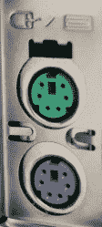

# USB-C:一个插头连接他们所有人，并在混乱中捆绑他们

> 原文：<https://hackaday.com/2019/07/29/usb-c-one-plug-to-connect-them-all-and-in-confusion-bind-them/>

USB 代表通用串行总线，自从它形成以来，USB 实现者论坛一直在努力研究等式的“通用”部分。USB Type-C，通常被称为 USB-C，是一种连接器标准，标志着他们在一个单一规范中统一所有有线连接的史诗般追求中的重要新篇章。

2015 年，当苹果推出 12 英寸 Retina MacBook 时，我们许多人都接触到了这个神奇的插头。苹果将一切都放在一个珍贵的 type-C 端口上的决定受到了批评，但这是一个有效的展示连接器可以处理一切:从充电到数据传输，再到视频输出。此后，它逐渐传播到更多的设备上。但正如最近关于 Raspberry Pi 4 的 USB-C 缺陷实现的故事所显示的，对通用连接器的追求是一个经常遇到挫折的旅程。

## 一个插头统治所有插头的不可思议的承诺

不需要电气工程师就能感受到 USB-C 的吸引力。许多消费者一看到它是可逆的，就被它迷住了。不再有 USB 插头的烦恼，神秘地设法颠倒过来！但它还能提供更多。

这种新连接器非常纤薄，足以容纳平板电脑和智能手机等最新的轻型设备，消除了厚筒连接器，同时携带足够的电力为笔记本电脑充电。与以前的版本相比，USB-C 的信号线数量大大增加，具有足够的吞吐量来支持多个 4K 屏幕，但它通过使用廉价的适配器保持了向后兼容性。该规范提供了超越 USB 的灵活性，支持 Thunderbolt、MHL 和甚至还不存在的协议。

单个通用端口对产品设计者很有吸引力，他们总是致力于驯服端口的大杂烩，每个端口具有不同的尺寸、形状和机械应变要求。用一排整齐的 USB-C 端口取代它们听起来像是天堂。所有这些使得 USB-C 的推出成为整个行业热切期待的事件，[包括这里的 Hackaday](https://hackaday.com/2016/04/22/hackaday-dictionary-usb-type-c/) 。随着标准在 Retina MacBook、Chromebook Pixel 等高端笔记本电脑和高端手机上推出，事情似乎有了一个良好的开端。

## 为什么我的 USB 线不工作？

这些早期产品的优势在于，它们大多可以连接购买时随附的外围设备，如充电器、耳机等。直到第三方配件开始进入市场，我们才发现 USB-C 有酸味。这时，USB-IF 会议的雄心勃勃的计划终于遇到了我们称之为现实世界的危险地带。

USB-C 的一个承诺是，我们将不再需要挖掘一大堆电缆，我们只需要 USB-C 电缆，一切都将正常工作。本质上，这消除了用户对 USB 的任何知识的需求——甚至电缆的哪一端插入哪个设备都变得没有意义。

但事实并非如此。当一家 USB-C 电缆制造商设法混淆电源线和地线来摧毁 Benson Leung 的 Chromebook Pixel 时，情况变得最糟。希望我们已经把那些恐怖的故事留在了过去，但是即使电缆是按照规格正确制造的，仍然不能保证事情会“正常工作”。USB-C 是一种电缆和连接器规范，但这些电缆可能会支持多种标准，从 USB 2.0/3.1/3.2 到电源传输(USB-PD)，以及包含许多其他标准的替代模式。试图通过这些多种有效的数据速度和功率水平满足所有设备的所有要求，这就形成了[六种不同方式的组合，以构建符合规范的电缆](https://people.kernel.org/bleung/how-many-kinds-of-usb-c-to-usb-c-cables-are-there)。这使得开发 USB-C 设备的测试矩阵变得复杂。不仅仅是因为当需要更高规格的电缆时，更低规格的电缆可能无法工作，还因为不兼容的实现意味着即使更低规格的电缆可以工作，但更高规格的电缆也无法工作。(如[与最初的问题批次树莓派 4](https://hackaday.com/2019/07/16/exploring-the-raspberry-pi-4-usb-c-issue-in-depth/) 。)

这些混乱的电缆和端口带来了糟糕的用户体验。仅仅因为 USB-C *可以*做这一切并不意味着一个特定的 USB-C 端口*会*。它供电吗？它接受权力吗？它携带视频吗？光看是没法分辨的。随着我们远离主流设备，情况会变得更糟。例如，谷歌的 [Coral 开发板](https://hackaday.com/2019/03/05/google-launches-ai-platform-that-looks-remarkably-like-a-raspberry-pi/)有两个 USB Type-C 端口。一个用于供电，另一个用于 USB 数据通信，辨别哪个是哪个的唯一方法是看 PCB 丝印。与 barrell 插孔或其他传统电源线相比。它们当然不是通用的，但用户不会将它们与 USB、Firewire 或以太网等数据连接器混淆。

## 到达那里需要练习

 从好的方面来看，情况仍比过去糟糕的日子要好。当 USB 1.0 推出时，它旨在取代的端口之一是 PS/2 端口。鼠标和键盘有机械上相同的 PS/2 插头，但如果插入错误的插头就无法工作。更糟糕的是，该端口没有热插拔功能，一些系统通过烧断用户不可更换的保险丝来保护自己免受电压尖峰的影响。相比之下，错误地连接或断开 USB-C 设备不会造成破坏(忽略严重不合格的电缆)。有时他们可能不“只是工作”，但至少他们优雅地失败了。

我们看到越来越多的[产品是围绕 USB-C](https://hackaday.com/2017/02/24/60-watt-usb-soldering-iron-does-it-with-type-c/) 的优势设计的，硬件黑客社区也在参与进来。“将其转换为 USB-C 电源”正迅速成为一个常见的项目主题。你可以[把它添加到旧笔记本电脑](https://hackaday.com/2019/05/07/add-usb-c-to-your-laptop-almost/)，或者用它[给你的无线鼠标](https://hackaday.com/2019/06/17/wireless-mouse-power-up-logitech-mx-master-gets-usb-c-and-big-battery/)充电。它甚至被添加到一个简易烤箱中。这个类别可能最终会达到“放一个覆盆子酱在里面”的流行程度。

像 Raspberry Pi 4 电源电路设计这样引人注目的事件可以作为整个社区的教训，希望不会再犯同样的错误。关键是帮助理解规范和如何测试新闻设计。我们还希望经过验证的参考设计，如[适当的 USB-C 电源接收器](https://medium.com/@leung.benson/how-to-design-a-proper-usb-c-power-sink-hint-not-the-way-raspberry-pi-4-did-it-f470d7a5910)，能够迅速成为一种标准化模式，人们可以将整个设计拖放到他们选择的 EDA 软件中。随着我们一起学习并在这方面做得越来越好，希望 USB-C 将真正成为连接它们的一个插头。