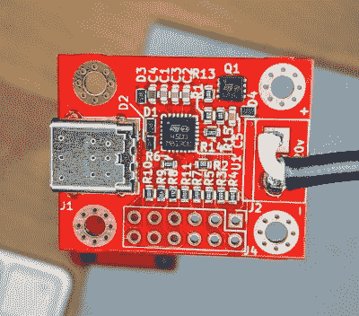

# USB 电源为所有东西供电

> 原文：<https://hackaday.com/2019/10/18/usb-power-delivery-for-all-the-things/>

USB 电力传输(USB-PD)的承诺是，我们最终将能够只用一个适配器为我们所有的设备供电，至少是功率低于 100 瓦的设备。考虑到我们大多数人都自豪地拥有一个装满各种形状和大小的交流/DC 适配器的盒子，这肯定是一个非常有吸引力的前景。但是[Mansour Behabadi]对他的各种电子设备加入 USB-PD 潮流的速度并不感到兴奋，所以他决定对此做点什么。

 【曼苏尔】想要一种简单的方法，通过 USB-PD 而不是 USB-C 为他的笔记本电脑(以及他能想到的任何东西)充电，但市场上现有的选项都不是他想要的。他环顾四周，最终发现了 STUSB4500，这是一种可以在 I2C 上配置的 USB 电力传输控制器芯片。

板载一点非易失性存储器，它可以保留其设置，所以他不必在设计中包括微控制器:只需编程一次，它可以独立使用，在插入时协商适当的电压和电流要求。

[Mansour 发明的](https://www.tindie.com/products/oxplot/stusb4500-compact-breakout/)板是一种通过 USB-C 为你的项目供电的便捷方式，无需另起炉灶。使用 PC 配置工具和 Arduino 通过 I2C 与 STUSB4500 通信，可将该板配置为向连接的任何设备提供 5 至 20 VDC 的电压。该芯片甚至能够同时存储三个独立的功率传输输出(PDO)配置，所以你可以给它多个电压和电流范围来尝试和协商。

在过去，我们已经看到了一个有点类似的项目，即[使用 USB-PD 为锂聚合物电池](https://hackaday.com/2019/04/25/charge-all-your-batteries-with-usb-pd/)充电。这当然不是一夜之间发生的，但看起来我们终于开始看到一些[真正朝着使 USB-C 成为标准](https://hackaday.com/2019/07/29/usb-c-one-plug-to-connect-them-all-and-in-confusion-bind-them/)的运动。