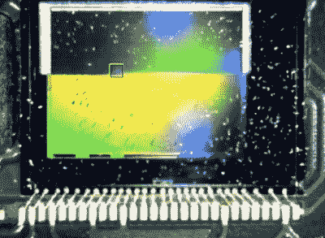

# 用激光摧毁拜尔阵列

> 原文：<https://hackaday.com/2021/08/09/using-a-laser-to-blast-away-a-bayer-array/>

拜耳阵列，或拜耳过滤器，是让数码相机拍摄彩色照片。它是一组微小的彩色滤光片，位于相机的 CCD 顶部。滤光器使得图像传感器中的每个子像素仅看到红色、绿色或蓝色光。拜尔滤镜是一个优雅的工具，它能给我们提供彩色数码照片，但是如果你想去掉一张，你会怎么做呢？

[Les Wright] [设计了一种从树莓派相机](https://www.youtube.com/watch?v=y39UKU7niRE)中移除拜耳滤镜的方法。除了为各自的传感器过滤红色、绿色和蓝色光之外，拜耳过滤器还大大减少了进入 CCD 传感器的紫外线和红外线的数量。【Les】在他的 [Pi 型光谱仪](https://hackaday.com/2021/04/23/pi-based-spectrometer-puts-the-complexity-in-the-software/)中使用了 Raspberry Pi 相机，他想去掉 Bayer 滤镜来提高和扩大它的灵敏度。

当然，[Les]并不是第一个想这么做的人。有些人已经成功地从 CCD 上刮下滤光器，但由于 Pi 相机在传感器外部有重要的电路，刮下滤光器可能会破坏电路。其他人已经用化学方法将其剥离，所以[Les]尝试了一下，并破坏了不少相机，试图用 DMSO、制动液和工业脱漆剂等溶剂剥离过滤器。

A look at the CCD, halfway through the process.

受到工业技术的启发，[Les]最终尝试使用几千瓦的氮激光器来烧掉过滤器(考虑到他使用激光器的经验，这似乎很合适)。他建造了一个装置，使用步进电机驱动测微器底座，使激光在传感器上进行光栅扫描。包括一个 USB 显微镜，以便监控进度，当过滤器被移除时，您可以看到传感器外观的变化。

在炸开拜耳过滤器后，[Les]将他改进的相机插入他自制的光谱仪，并指向外面。新相机使光谱仪的灵敏度更加一致，并允许[Les]在红外和紫外波段看到更远的地方。该光谱仪甚至可以探测到夫琅和费线——大气中分子吸收造成的太阳光谱的细微下降。

这对于一个 DIY 设置和仪器来说是不可思议的，我们迫不及待地想知道[Les]下一步会做什么来改进他的测量。如果你的光谱分析需求更多的是质量而不是视觉，看看这个[自制的质谱仪](https://hackaday.com/2019/12/04/ben-krasnow-builds-a-mass-spectrometer/)。家用光谱仪不仅仅用于检测光谱——它们还可以用来[判断水果的成熟度！](https://hackaday.com/2021/07/22/detecting-ripeness-in-fruit-and-vegetables-via-neural-networks/)

 [https://www.youtube.com/embed/y39UKU7niRE?version=3&rel=1&showsearch=0&showinfo=1&iv_load_policy=1&fs=1&hl=en-US&autohide=2&wmode=transparent](https://www.youtube.com/embed/y39UKU7niRE?version=3&rel=1&showsearch=0&showinfo=1&iv_load_policy=1&fs=1&hl=en-US&autohide=2&wmode=transparent)

