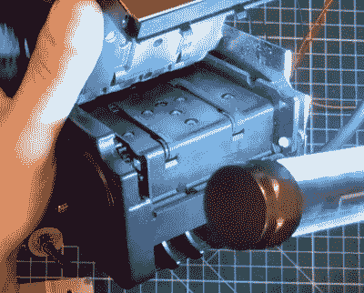

# 通过 Arduino 使用自动售货机纸币接收器

> 原文：<https://hackaday.com/2020/03/31/using-a-vending-machine-bill-acceptor-with-arduino/>

我们都见过，偶尔还会与像最近从街机中解放出来的(另一个制造商)这样的钞票接受者搏斗。但是你有没有拆开过一个看看它是怎么工作的？如果不是，休息后的视频是一个有趣的高峰，它展示了这个无处不在的硬件如何区分真正的钞票和一张纸。

 但是【另一个制造商】比仅仅展示设备的内部更进一步。他还经历了[的麻烦，弄清楚如何用 Arduino](https://github.com/mudmin/AnotherMaker/tree/master/arduino-powered-cash-reader) 与它对话，这使得各种赚钱的项目成为可能。即使你不喜欢收集纸币，看看这个小工具在硬件和软件层面上是如何工作的仍然很有趣。

正如视频中所解释的那样，一组传送带用于将钞票拉过红外发光二极管阵列。硬件使用这些来扫描钞票，并执行一些黑魔法来确定它是否是一张真正的货币。[另一位制造商]指出，这些阅读器实际上需要偶尔更新固件，以适应新的钞票设计。事实上，他的特别装置已经过时了，它不接受现代的 5 美元钞票；这也许可以解释他最初是如何免费得到它的。

[几年前，我们看到其中一个纸币接收器被用来制作 DIY 比特币 ATM](https://hackaday.com/2014/02/20/open-bitcoin-atm/) 。当然，那时候，几块钱就能让你买到半合理数量的 BTC。如今，你可以[跳过纸币，全部用数字方式完成](https://hackaday.com/2020/03/09/divvy-out-the-crypto-with-this-physical-bitcoin-faucet/)。

 [https://www.youtube.com/embed/Ot7_iEwcphg?version=3&rel=1&showsearch=0&showinfo=1&iv_load_policy=1&fs=1&hl=en-US&autohide=2&wmode=transparent](https://www.youtube.com/embed/Ot7_iEwcphg?version=3&rel=1&showsearch=0&showinfo=1&iv_load_policy=1&fs=1&hl=en-US&autohide=2&wmode=transparent)

