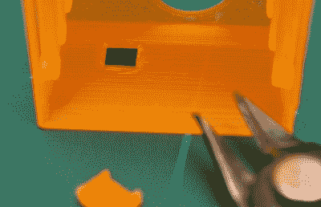

# 使用螺旋模式快速打印附件

> 原文：<https://hackaday.com/2020/04/13/using-spiral-mode-to-rapidly-print-enclosures/>

我们常说，桌面 3D 打印的最佳应用之一是定制外壳的生产。定制的盒子可以为任何项目增添一丝专业气息，考虑到打印一个盒子所需的材料甚至比最便宜的普通项目盒子还要便宜，这是显而易见的。只有一个问题:即使打印一个简单的案例也需要几个小时。

为了加快速度，[Electrobob]已经在他的 3D 打印机上尝试使用螺旋或“花瓶”模式运行外壳。与正常的逐层方法不同，在这种模式下，打印机的 hotend 在整个打印过程中以稳定的速率持续上升。把它想象成类似于打印出一个 Slinky，你应该明白了。

Spiral printed boxes may need manual retouching

正如您所料，这里有一些权衡。首先，盒子的壁不能太厚，因为打印机只能打印一次。大多数打印机上的喷嘴是 0.4 毫米，但在他的实验中，[Electrobob]发现他能够通过调整挤压率，可靠地将喷嘴厚度增加一倍，达到 0.8 毫米。

在 CAD 阶段，您还需要以稍微不同的方式进行设计。在外壳侧面印刷孔，这在正常情况下很容易做到，但在螺旋模式下运行时并不真正起作用。对于这些情况，[Electrobob]建议在侧面设计一个“口袋”,你可以回来用刀把它切开。这会给后期处理阶段增加一点时间，但是在打印过程中节省的时间将足以弥补这一点。

那么我们说的速度有多快呢？在[Electrobob]在他的文章中展示的例子中，打印时间从近两个小时减少到仅仅 18 分钟。由此产生的外壳显然看起来有点不同于传统的印刷版本，也没有那么强大，但这个概念仍然显然对一些应用有希望。如果你正在[构建一个需要一堆机箱的传感器网络](https://hackaday.com/2019/04/05/building-an-army-of-esp32-air-quality-sensors/)，这些节省的时间真的会增加。