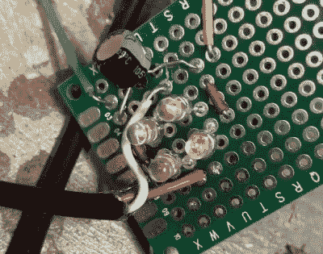

# 带有自供电继电器的真空吸尘器

> 原文：<https://hackaday.com/2020/06/06/vacuum-dust-collection-with-self-powered-relays/>

像许多拥有多种木工工具的人一样，[Will Stone]想要创建一个集中的灰尘收集系统。但他很快发现，问题出在细节上，因为他在努力寻找一种经济的方法，在其中一个工具启动时自动启动真空。他的最终解决方案可能是我们见过的最优雅，当然也是最便宜的解决方案之一。

 正如我们多年来看到的其他 DIY 系统一样，[威尔]使用一个简单的感应电流传感器来检测他的工具何时使用交流电。但相似之处在于，没有什么比微控制器读取传感器输出更简单的了。他意识到，当传感器中的线圈通电时，它们会输出大约 7 伏的交流电，这应该足以触发继电器。

因此，他在一块 perfboard 上组装了一个整流电路，使用了真正黑客风格的四个 led。通过增加一个电容器来平滑电压，这个小电路能够使 40 安培的固态继电器跳闸，只使用从传感器线圈获得的能量来控制真空。

当工具足够近，可以插入同一条线时，使用电流传感器很好，但这对使用无线工具或超大型商店的人没有帮助。在这种情况下，[你可能需要研究一个声音激活系统](https://hackaday.com/2020/02/10/building-a-sound-activated-shop-fan-with-arduino/)。