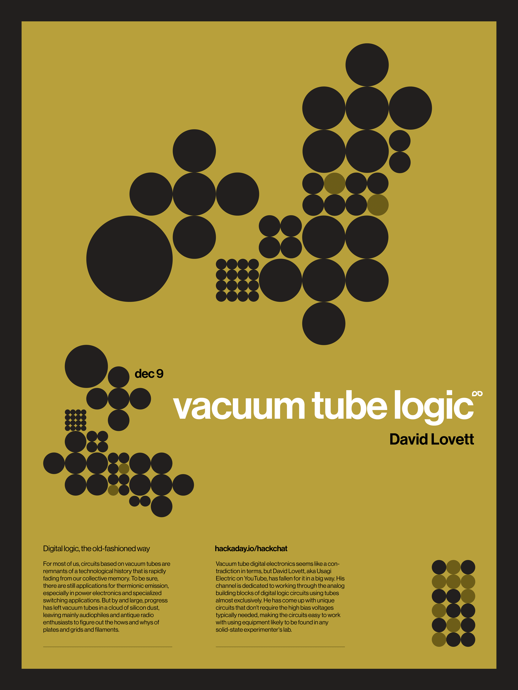

# 真空管逻辑黑客聊天

> 原文：<https://hackaday.com/2020/12/07/vacuum-tube-logic-hack-chat/>

加入我们太平洋时间 12 月 9 日星期三中午的[真空管逻辑黑客聊天](https://hackaday.io/event/175628-vacuum-tube-logic-hack-chat)与[大卫·洛维特](https://hackaday.io/hacker/1127099-usagi-electric-david)！

对我们大多数人来说，基于真空管的电路是技术历史的残余，正在从我们的集体记忆中迅速消失。当然，热离子发射仍有应用，尤其是在电力电子和专门的开关应用中。但是总的来说，进步已经把真空管留在了硅尘云中，主要让音响发烧友和古董收音机发烧友去弄清楚板、栅格和灯丝的工作方式和原因。

但是真空管不仅仅是模拟世界的专利。有些人喜欢让电子管做一些他们已经很久很久没有做过的事情，至少从计算机时代诞生以来是这样的。真空管数字电子似乎是一个矛盾的术语，但大卫·洛维特，在 YouTube 上也被称为[天兔电气](https://www.youtube.com/c/Nakazoto/videos)，已经深深地爱上了它。他的频道致力于几乎完全使用电子管来构建数字逻辑电路的模拟模块。他想出了独特的电路，不需要通常需要的高偏压，使电路易于使用任何固态实验室中可能找到的设备工作。

大卫会顺便来 Hack Chat 分享他对真空管逻辑的热情，以及他探索飞行电子这个有时很奇怪的世界的技巧。加入我们，讨论如何设置您自己的真空管实验，了解热离子发射可以教给我们什么有关固态电子学的知识，甚至可能对他的实验室有所了解。

 我们的黑客聊天是 [Hackaday.io 黑客聊天群发消息](https://hackaday.io/messages/room/2369)中的社区直播活动。本周，我们将于太平洋时间 12 月 9 日星期三中午 12:00 坐下来讨论。如果时区束缚了你，我们有[一个方便的时区转换器](https://www.timeanddate.com/countdown/generic?iso=20201209T12&p0=224&msg=Vacuum+Tube+Logic+Hack+Chat&font=cursive)。

点击右边的那个发言气泡，你会被直接带到 Hackaday.io 上的黑客聊天群，不用等到周三；随时加入，你可以看到社区在谈论什么。

