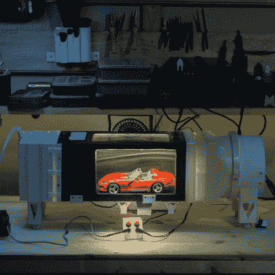

# 蒸汽轨迹和风扇可以在 DIY 风洞中拍出精彩的照片

> 原文：<https://hackaday.com/2022/07/10/vapor-trails-and-fan-make-for-fantastic-photos-in-diy-wind-tunnel/>

每个人都想要一个迷你风洞来检查比例模型汽车，无人机或其他小物体的空气动力学？然后再来看看【dannyesp】的[大多是——3D 打印的 DIY 风洞](https://www.youtube.com/watch?v=KDfYkI4TMs0)(视频，下面嵌入)。不要忘了浏览 Reddit 帖子中的附加照片[。](https://www.reddit.com/r/3Dprinting/comments/vsr7r3/i_made_a_mostly_3d_printed_wind_tunnel_idk_if/)

A junk parts project doesn’t have to *look* like a hack job.

没有太多可用的计划，因为正如[dannyesp]承认的那样，这种设备在很大程度上是反复试验和垃圾箱部件的产物。视频和照片对任何有事业心的黑客来说都绰绰有余。

该设备的核心是一个由废旧无人机电机制成的大型风扇。这个风扇位于隧道的后部。一个小型风速计放置在前面，一些 3D 打印的挡板也可以平滑湍流的进入空气。

雾状的蒸汽痕迹来自一只被砍碎的蒸汽笔。蒸汽通过一些管道输送到隧道的前面。在那里，蒸汽轨迹被拉向后方的低压区域，在途中绕着物体运行。[dannyesp]还提到，支撑物体的平台安装在轨道上，轨道上装有某种压力传感器，试图量化风阻。

我们想花一点时间来欣赏这个“垃圾零件”项目看起来有多干净——尽管它是由像碎相框这样的东西制成的。所有这些都归结于深思熟虑的组装。毕竟，一个黑客并不需要看起来像一个黑客。我们还喜欢这个小控制盒，它没有单独的电源指示灯，而是在有电时像小夜灯一样亮起。

改装汽化器是制造一台小型便携式烟雾机的好方法。这些可以创造出奇妙的服装效果，就像[这个冒烟的幽灵骑士头骨](https://hackaday.com/2018/10/26/ghost-rider-costume-is-smoking-hot/)。它们是把现成的消费品变成几年前还贵很多的东西的好方法。

 [https://www.youtube.com/embed/KDfYkI4TMs0?version=3&rel=1&showsearch=0&showinfo=1&iv_load_policy=1&fs=1&hl=en-US&autohide=2&wmode=transparent](https://www.youtube.com/embed/KDfYkI4TMs0?version=3&rel=1&showsearch=0&showinfo=1&iv_load_policy=1&fs=1&hl=en-US&autohide=2&wmode=transparent)

