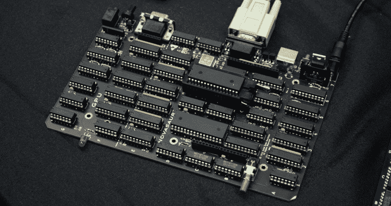
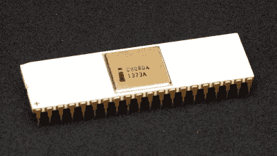

# VCF 东部 2021:诺瓦索 TTL 计算机设置酒吧

> 原文：<https://hackaday.com/2021/10/25/vcf-east-2021-novasaur-ttl-computer-sets-the-bar/>

在 2021 年东部老式计算机节上，展出的独特的计算机肯定不少；这就是问题的关键。但是，即使信息时代科学和历史博物馆的椽子上堆满了可以追溯到数字时代初期的怪异和奇妙的计算设备，[阿拉斯泰尔·休伊特的 Novasaur 仍然有点古怪。](https://hackaday.io/project/164212-novasaur-cpm-ttl-retrocomputer)

事实上，除非你提前知道它是什么，否则你甚至可能认不出它是一台计算机。无论如何，肯定不是当代的。它的 Polycase ZN-40 外壳内没有任何东西看起来像现代的 CPU、一组 RAM 或存储设备。那些对老式机器有经验的人可能会认为，密集排列的高级肖特基 TTL 芯片是 8 位微处理器出现之前的某种计算机的原料，但与 20 世纪 70 年代使用这种技术的机器相比，它的单个 200 毫米 x 125 毫米(8 英寸 x 5 英寸)的电路板似乎太小了。那是什么呢？

受 Gigatron 等项目的启发，Alastair 将 Novasaur 描述为使用 1980 年前的组件构建的“全功能个人计算机”。在他的设计中，22 个独立的 IC 代表计算机的 CPU，另外 12 个负责图形子系统，可以通过 VGA 以高达 416 x 240 的分辨率推出文本和位图图像。它有 512 K RAM，256 K ROM，能够快速模拟 Intel 8080，足以运行 CP/M，甚至可以玩一些 80 年代早期的 PC 游戏。

## 通过竞争让生活更美好

可以说，Novasaur 最值得注意的特性是它能够模拟老式 CPU。通过采用这种方法，Alastair 基本上确保了他在技术上必须为计算机编写的唯一软件是硬件抽象层。一旦安装到位，他就可以简单地加载现有的程序和操作系统，这些程序和操作系统是为在仿真芯片上运行而设计的。

一般来说，TTL 计算机需要为它们编写新的应用程序。[以 Gigatron 为例](https://hackaday.com/2019/03/25/how-the-gigatron-ttl-microcomputer-works/)，该系统的 ROM 为用户提供了一些专门为硬件编写的工具和游戏。但是除此之外，在系统上获得新软件的最好办法是使用微型 BASIC 解释程序，自己编写。

 

英特尔 8080 功劳:Konstantin Lanzet[CC BY-SA 3.0]

novas aur 运行 CP/M 和现有英特尔 8080 软件的能力使其成为比我们过去见过的其他机器更实用的机器，并且是其成为“全功能个人计算机”而不仅仅是计算极简主义实验的核心。但有趣的是，查看项目日志[显示，使用 8080 的决定直到游戏后期才做出。最初，阿拉斯泰尔的目标是让他的机器兼容摩托罗拉 6800 系列芯片，或者 MOS 6502 的某个子集。](https://hackaday.io/project/164212/logs)

差不多一年后，他才发表了一篇文章，解释了他决定瞄准相对被忽视的 RCA 1802 COSMAC 的原因。一个月后，在 Gigatron 的创造者 Marcel van Kervinck 的推荐下，他再次评估了形势。最初，他被 Z80 的复杂性吓跑了，但英特尔 8080 似乎提供了一个合理的中间地带。Alastair 说，由于他的计算机需要 137 个周期来完成一条 CPU 指令，最终模拟的 CPU 工作频率约为 450 kHz，比原始硬件快 22%。

## 活生生的历史

虽然诺瓦索龙本身就是一个不可思议的成就，但人们也不得不称赞阿拉斯泰尔整理的非凡文献。自 2019 年初以来，他一直通过 Hackaday.io 页面上的日志更新记录他的 TTL 计算机的规划、设计和建造的每一个步骤。

事实上，我们可以回顾过去，看看到底是什么促使他改变思路，开始关注英特尔 8080 兼容性，或者图形系统第一次点亮真正的 CRT 显示器时是什么样子，这对其他可能在类似系统上工作的人来说是一个非常宝贵的资源。当然，即使你不打算自己造一台 TTL 计算机，看看它是如何组装起来的也是很有趣的。

具有讽刺意味的是，尽管 Novasaur 在老式计算机节上展出，但它几乎肯定是大楼里最新的硬件之一。毕竟，PCB 在这个夏天刚刚完成了它的最终版本(至少目前如此)。尽管如此，仍然很少有其他机器像这种爱的劳动一样感觉真实，我很高兴 VCF 不仅给了我近距离观看它的机会，还让我见到了它异常热情的创造者。