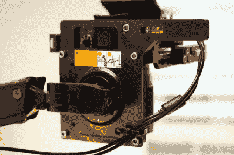

# VESA 臂转低成本高架摄影钻机

> 原文：<https://hackaday.com/2021/02/08/vesa-arm-turned-low-cost-overhead-camera-rig/>

无论您是进行实时流构建，还是只是想将项目摄影提升到一个新的水平，您都无法击败高架摄像机设置。不幸的是，它们往往很笨重，而且往往很贵。为了寻找一种经济实惠的解决方案，在不使用时可以轻松移开， [[Jay Doscher]想出了一个聪明的主意，改装一个普通的 VESA 监视器臂](https://back7.co/home/overhead-camera-bracket-top-down-video-and-photos-made-easy)，让他的相机可以鸟瞰活动。

如果你仔细想想，这些显示器臂中的一个几乎是相机支架的完美底座。它们很容易安装在桌子或工作台上，可以通过设计快速重新定位，也许最重要的是，你不必花很多钱来买一个像样的。与手臂的设计相比，相机的有效载荷也要轻得多，不那么笨拙，所以你不必担心它可能会掉落你昂贵的设备。或者便宜的网络摄像头，视情况而定。

 【杰伦】所要做的就是想出一个办法，将他的索尼 A7R3 安全地安装在 one 的一端。虽然肯定有一些方法可以解决这个特殊的问题，但他走了挤压塑料的路线，3D 打印了一个带有标准 VESA 螺栓图案的结实的转接板。他的 Smallrig 相机架连接到板上，由于麦克马斯特卡尔的一对压配合气泡水平仪，他能够在长凳上正确排列一切。

当然，很有可能你没有和[Jay]一样的相机。但这并不意味着你不能修改他的适配器的设计，以适应自己的齿轮。为此，他不仅分享了最终的 STLs，还提供了一个链接到 [TinkerCAD 项目，你可以在浏览器](https://www.tinkercad.com/things/1kfHLadE0Q4-sizzling-snicket)中进行编辑。

如果你有一个足够轻的相机，你可以[用 PVC 管](https://hackaday.com/2011/10/09/workbench-overhead-camera-boom-made-from-pvc/)或者甚至[一个用于台灯的铰接臂](https://hackaday.com/2011/10/12/cheap-ikea-camera-boom-ensures-shake-free-video/)把类似的东西放在一起。但如果你有一台 DSLR 或其他全尺寸相机，我们认为它比亚马逊上的 30 美元更值得，以确保你的设备不会在直播过程中摔到甲板上。