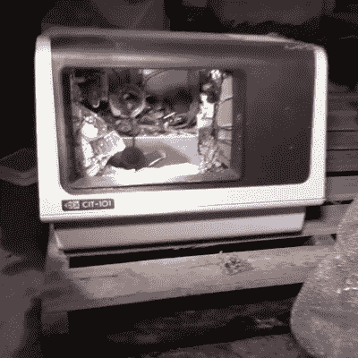
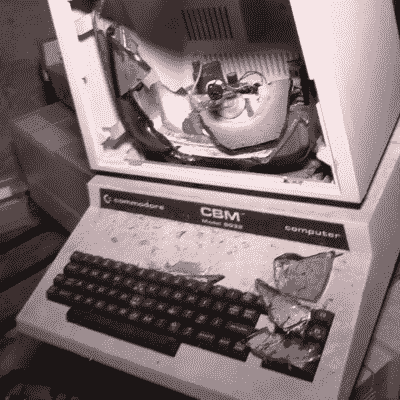
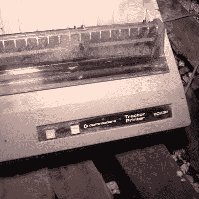
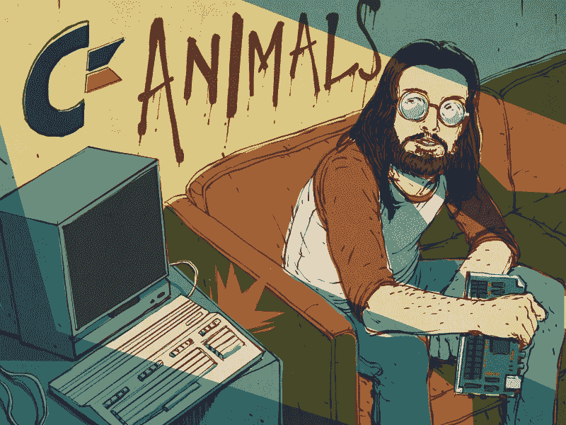

# 视频:探索 6502 和准将 64 的废弃诞生地

> 原文：<https://hackaday.com/2020/09/30/video-exploring-the-abandoned-birthplace-of-the-6502-and-commodore-64/>

我想念我的朋友戴夫·迪奥里奥。他在 20 世纪 80 年代是一名芯片设计师，这使他成为当时真正的奇才之一。我在 Commodore Business Machines 开始工作的第一天，我们就认识了，尽管我的薪水支票上写着 MOS 技术。

MOS 技术是古老的 6502 微处理器、VIC 视频芯片和 SID 声音芯片的诞生地。它还为我们带来了 TED 文本显示芯片，一整船的 Amiga 芯片，以及其他几个几乎完成了我们想要的功能的芯片。

我和魔术师一起工作，他们的股票和交易一半是量子隧道效应，一半是简单的逻辑实现。这些魔术师不受 TTL 逻辑可用引脚数量的限制，不像我们这些低级硬件工程师必须将 14 和 16 引脚芯片串在一起才能做任何真正的提升。

在绘制设计的斯巴达式办公室下面，住着一条龙，也被称为芯片制造厂，是集成电路制造厂的缩写。这只野兽吃沙子，做薄饼；晶体形式的几乎纯硅薄片，上面巧妙地生长着各种复杂的东西。

## 记忆巷:参观废弃的 MOS 总部

 [https://www.youtube.com/embed/OI20uSRtJUU?version=3&rel=1&showsearch=0&showinfo=1&iv_load_policy=1&fs=1&hl=en-US&autohide=2&wmode=transparent](https://www.youtube.com/embed/OI20uSRtJUU?version=3&rel=1&showsearch=0&showinfo=1&iv_load_policy=1&fs=1&hl=en-US&autohide=2&wmode=transparent)

MOS 技术由 Allen Bradley 于 1969 年创立，但后来变成了*MOS，当我谈到美好的旧时光时，我会想起 [Chuck 兜售](https://hackaday.com/2019/12/25/honoring-chuck-peddle-father-of-the-6502-and-the-chips-that-went-with-it/)和一群来自摩托罗拉的同伴，包括 Bill Mensch，席卷而来，生产了 6502 微处理器，这与特定的摩托罗拉处理器有许多相似之处，事实上非常相似。诉讼接踵而至。*

与此同时，6502 正在接管几个行业，成为从医疗设备到微波炉到家用电脑的一切产品的首选处理器。我是在设计家用电脑的时候，站在一家芯片制造厂上方遇见戴夫的。我仍然记得那条龙在我们脚下放屁的味道…说我怀念那些时光是轻描淡写的。

几年前，我有机会重返故地，并(合法地)踏上了位于宾夕法尼亚州诺里斯敦的 MOS 总部——最终成为 CSG(Commodore Semiconductor Group)。地下室又脏又淹，但我们找到了晶片，一片来自我工作过的一台电脑。

一楼黑暗而安静，我站在肮脏的玻璃门外看着一条单调的街道，我很快就继续前进，然后我被某种不言自明的生活隐喻击中，这将是令人讨厌的。

二楼是我们的办公室。设计截止日期的压力早就离开了这个地方，现在能看到的只是窗外的高尔夫球场和某人生的一堆篝火。我给戴夫看了这个视频，包括他旧办公室窗外的景色，想到 35 年后的今天，我们都笑了。

戴夫已经去世了，世界少了一个巫师，正如视频所示，龙早已安静下来。