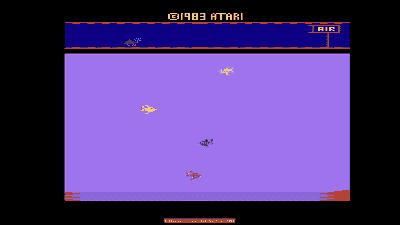

# 像 1983 年一样的视频游戏:雅达利的新游戏盒

> 原文：<https://hackaday.com/2021/11/18/video-gaming-like-its-1983-new-game-cartridges-from-atari/>

如果你记得 1983 年的任何事情，很可能是今年的一些流行文化亮点，也许是《绝地归来》或迈克尔·杰克逊的《T2》惊悚片。然而，对于任何与视频游戏行业有关的人来说，这一年可能会因为一个完全不同的原因而留在脑海中，因为这一年是臭名昭著的大型视频游戏崩溃的一年。游戏机市场的产能过剩加上大量低质量的游戏导致销售崩溃，许多公司倒闭，游戏机游戏世界只能在十年后随着任天堂和世嘉的日本 8 位游戏机的到来而复苏。你可能会认为雅达利会回避他们历史上的这段痛苦时期，但相反，他们将此作为他们 50 周年纪念的一部分，并且[为他们的 8 位 2600 游戏机](https://www.atari.com/atarixp-launches-new-game-cartridge-initiative-with-the-release-of-three-never-published-titles/)推出了三款从未发布过的游戏。

Game footage from *Aquaventure*.

这三款游戏分别是 *Yars' Return、* *Aquaventure* 和*destrooper*，它们都是过去未发行的游戏，因为崩溃而从未公开发行，并通过 [AtariXP](https://atarixp.com/) 作为限量版特价游戏发行，该公司表示，新公司将提供“*以前未发行的游戏，这些游戏来自 Atari 庞大的图书馆，稀有且难以找到的 Atari IP 物理媒体，以及经典游戏的改进版本*。很明显，这是为了满足收藏者的需求，而不是游戏发行，但是看看会出现什么会很有趣。我们尤其希望有人能拆掉其中一个墨盒；他们会在里面找到一套老派的 EPROM 还是一个带有微控制器和其他 20 世纪 20 年代诡计的 EPROM 仿真器？

这当然不是我们第一次报道可收集的 2600 个弹壳，但是这些弹壳还没有在垃圾填埋场呆上 30 年。

头图:埃文-阿莫斯，[公共领域](https://commons.wikimedia.org/wiki/File:Atari-2600-Wood-4Sw-Set.jpg)。