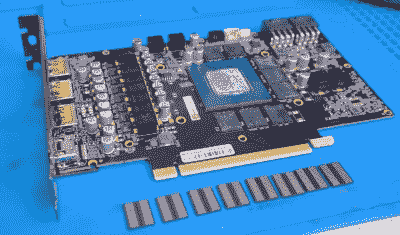

# 视频内存移植将 RTX 3070 内存翻倍至 16 GB

> 原文：<https://hackaday.com/2021/03/20/video-ram-transplant-doubles-rtx-3070-memory-to-16-gb/>

让不可获得的显卡更加不可获得的是，[VIK-on]已经[更换了英伟达 RTX 3070](https://www.youtube.com/watch?v=14jzlR4yGCQ)上的 RAM 芯片。这使得它成为世界上唯一一款支持 16 GB 的 3070。

如果这听起来很熟悉，那是因为他在一月份对 RTX 2070 尝试了同样的技巧[，但无法让它工作。当他第一次发布展示拆下 3070 的 8 个 Hynix 1 GB 内存芯片并用 8 个三星 2 GB 芯片替换它们的过程的视频时，他遇到了同样的问题——卡可以启动并检测增加的 RAM，但不稳定，最终会崩溃。来自观众的有用提示让他使用 EVGA 配置 GUI 来锁定工作频率，从而解决了问题。进一步的故障排除(YouTube](https://hackaday.com/2021/01/29/add-an-extra-8gb-of-vram-to-your-2070/) [的俄语评论](https://www.youtube.com/watch?v=wh5EeJKUYjk&lc=UgzYrQ8GzAxExp040S14AaABAg)和[的机器翻译](https://translate.google.com/?sl=auto&tl=en&text=%D0%B5%D1%89%D0%B5%20%D0%BE%D0%B4%D0%BD%D0%BE%20%D0%BE%D0%B1%D0%BD%D0%BE%D0%B2%D0%BB%D0%B5%D0%BD%D0%B8%D0%B5...%20%D0%BE%D0%BA%D0%B0%D0%B7%D1%8B%D0%B2%D0%B0%D0%B5%D1%82%D1%81%D1%8F%20%D0%BB%D0%B0%D1%80%D1%87%D0%B8%D0%BA%20%D0%BF%D1%80%D0%BE%D1%81%D1%82%D0%BE%20%D0%BE%D1%82%D0%BA%D1%80%D1%8B%D0%B2%D0%B0%D0%B5%D1%82%D1%81%D1%8F%2C%20%D0%BF%D0%BE%20%D0%BF%D0%BE%D0%B4%D1%81%D0%BA%D0%B0%D0%B7%D0%BA%D0%B5%20%D0%BE%D0%B4%D0%BD%D0%BE%D0%B3%D0%BE%20%D0%B8%D0%B7%20%D0%BF%D0%BE%D0%B4%D0%BF%D0%B8%D1%81%D1%87%D0%B8%D0%BA%D0%BE%D0%B2%2C%20%D0%BF%D1%80%D0%B8%20%D0%B2%D1%8B%D0%B1%D0%BE%D1%80%D0%B5%20%D0%BC%D0%B0%D0%BA%D1%81%20%D1%80%D0%B5%D0%B6%D0%B8%D0%BC%D0%B0%20%D0%BF%D1%80%D0%BE%D0%B8%D0%B7%D0%B2%D0%BE%D0%B4%D0%B8%D1%82%D0%B5%D0%BB%D1%8C%D0%BD%D0%BE%D1%81%D1%82%D0%B8%20%D0%B2%20%D0%BF%D0%B0%D0%BD%D0%B5%D0%BB%D0%B8%20%D0%BD%D0%B2%D0%B8%D0%B4%D0%B8%D1%8F%20%D0%BA%D0%B0%D1%80%D1%82%D0%B0%20%D1%81%D1%82%D0%B0%D0%BB%D0%B0%20%D0%BD%D0%BE%D1%80%D0%BC%D0%B0%D0%BB%D1%8C%D0%BD%D0%BE%20%D1%80%D0%B0%D0%B1%D0%BE%D1%82%D0%B0%D1%82%D1%8C%20%D0%B1%D0%B5%D0%B7%20%D0%BA%D0%BE%D1%81%D1%82%D1%8B%D0%BB%D0%B5%D0%B9.%20%D1%82%D0%B0%D0%BA%20%D1%87%D1%82%D0%BE%20%D0%BA%D0%B0%D0%BA%20%D1%82%D0%BE%20%D1%82%D0%B0%D0%BA.%20%D0%B5%D0%B4%D0%B8%D0%BD%D1%81%D1%82%D0%B2%D0%B5%D0%BD%D0%BD%D0%BE%D0%B5%20%D1%87%D1%82%D0%BE%20%D1%87%D0%B0%D1%81%D1%82%D0%BE%D1%82%D0%B0%20%D1%8F%D0%B4%D1%80%D0%B0%20%D0%B8%20%D0%BF%D0%B0%D0%BC%D1%8F%D1%82%D0%B8%20%D0%B2%20%D1%8D%D1%82%D0%BE%D0%BC%20%D1%81%D0%BB%D1%83%D1%87%D0%B0%D0%B5%20%D0%B4%D0%B5%D1%80%D0%B6%D0%B8%D1%82%D1%81%D1%8F%20%D0%BD%D0%B0%20%D1%83%D1%80%D0%BE%D0%B2%D0%BD%D0%B5%201770%2F7000%20%D1%81%D0%BE%D0%BE%D1%82%D0%B2%D0%B5%D1%82%D1%81%D1%82%D0%B2%D0%B5%D0%BD%D0%BD%D0%BE%20%D0%BD%D0%BE%20%D1%8D%D1%82%D0%BE%20%D1%83%D0%B6%D0%B5%20%D0%BC%D0%B5%D0%BB%D0%BE%D1%87%D0%B8%0A&op=translate))表明，Nvidia 工具中的“最高性能模式”设置也是稳定性能的一种解决方案。

 新内存条不向配置工具自我报告规格。相反，一组三个电阻用于电子识别哪个硬件存在。问题是[VIK-on]不知道哪些电阻和不同的配置完成了什么。听起来好像你可以开始改变零欧姆电阻来查看 GUI 中的效果，因为它们配置了内存的品牌和可用的大小。事实上，该板目前不提供 16 GB 选项，但当电阻配置正确时，配置工具会为其提供设置，这是命中注定的。

这有很大的不同吗？那很难说。他在视频中运行一些基准测试，显示了 Unigine 2 叠加和 3DMark Time Spy 结果。然而，在芯片交换之前，我们没有看到任何测试运行。这本来是描述黑客攻击真正影响的关键。也就是说，用手持式热风站改造这些，并通过电阻配置来工作，无论最终的性能提升如何，都令人印象深刻。

 [https://www.youtube.com/embed/14jzlR4yGCQ?version=3&rel=1&showsearch=0&showinfo=1&iv_load_policy=1&fs=1&hl=en-US&autohide=2&wmode=transparent](https://www.youtube.com/embed/14jzlR4yGCQ?version=3&rel=1&showsearch=0&showinfo=1&iv_load_policy=1&fs=1&hl=en-US&autohide=2&wmode=transparent)

 [https://www.youtube.com/embed/wh5EeJKUYjk?version=3&rel=1&showsearch=0&showinfo=1&iv_load_policy=1&fs=1&hl=en-US&autohide=2&wmode=transparent](https://www.youtube.com/embed/wh5EeJKUYjk?version=3&rel=1&showsearch=0&showinfo=1&iv_load_policy=1&fs=1&hl=en-US&autohide=2&wmode=transparent)

