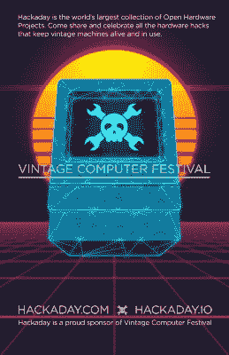

# 这个周末是西部老式电脑节

> 原文：<https://hackaday.com/2021/08/05/vintage-computer-festival-west-is-this-weekend/>

 本周末是[Vintage Computer Festival(VCF)West](https://vcfed.org/wp/festivals/vintage-computer-festival-west/)，将在加州山景城的计算机历史博物馆亲自举办。这是完整的活动日程安排。

如果您在该地区，请参加这个为期两天的活动，Hackaday 很荣幸能够赞助这个活动。谁知道呢？你可能最终会和那些最终有自由谈论旧日时光的原始系统开发人员聚在一起。

举个例子:Hackaday 自己的 Bil Herd 将会在那里讨论他和 Margaret Moribito 一起写的历史书里的[新准将。其他演讲者包括鲍勃·珀维，他将讨论](https://www.amazon.com/dp/B09BDF92F4/ref=cm_sw_em_r_mt_dp_3BGAHTMX2HBN248M040T)[他关于施乐明星](https://www.amazon.com/dp/1736298615/ref=cm_sw_em_r_mt_dp_VTXF04STXY45Q1JBD6WF)的小说。这不是一般的历史书——它用虚构的人物来演绎真实的事件。另一个讲座深入研究了计算机井字游戏的历史，还有一个讲座将涉及用示波器找回丢失的软盘。最后，Liza Loop 将讲述计算在教育中的历史，以结束周末的讲座。

日程表上也有很多展览，包括来自日本的稀有计算机和 20 世纪 60 年代的模拟计算。别忘了，你在计算机历史博物馆，所以不应该有任何接近无聊的时刻。玩得开心！