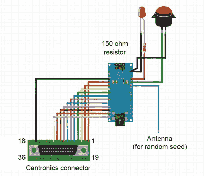

# 复古迷你喷墨打印按需 ASCII 艺术

> 原文：<https://hackaday.com/2020/01/09/vintage-mini-inkjet-prints-on-demand-ascii-art/>

某个年龄的读者可能会深情地记得在一个早已过去的计算时代，行式打印机中出现的 ASCII 艺术；对于其他人来说，这只是奇妙的复古。当[艾米丽·维拉斯科]在当地旧货店以 4 美元的价格找到一台老式柯达 Diconix 150 喷墨打印机时，她知道她必须做什么:[把它变成一台专用的 ASCII 艺术机器](https://youtu.be/hEMUWPn05PM)。

追溯到 20 世纪 80 年代中期，她得到的小型打印机是消费喷墨技术的早期例子；它只有 12 个“喷头”，分辨率大约相当于当时的点阵击打式打印机。[Emily]注意到，按今天的价格计算，这台打印机的价格应该在 1000 美元左右，这是在打印机公司开始将打印机本身作为亏本产品销售以从后端耗材销售中获利之前。看起来你无法逃脱剃刀和刀片的模式，尽管:[Emily]不得不花 16 美元买了一个新的墨盒来恢复 4 美元的打印机。

 随着新墨水的到位，以及一些牵引纸的获得，【艾米丽】开始着手艺术生成器的工作。这个概念可能已经在深夜电视广告上销售过了:一个“墨盒”,你把它插到你的打印机上就可以做出 ASCII 杰作。从一根与打印机端口匹配的 Centronics 打印机电缆开始，她添加了一个 Arduino nano 来存储和提供艺术作品。用户界面非常简单:只需按一下按钮，就可以从 10 幅 ASCII 图像中随机选择一幅进行打印。整个东西都藏在一个光滑的 3D 打印的盒子里。

这个项目最酷的一个方面就是缺少电力供应。当她第一次将 Arduino 连接到打印机的并行端口时，[Emily]注意到它在没有外部电源的情况下就通电了，并且以真正的黑客方式，只是运行它。经过思考，似乎是打印机状态线 Busy 和/或 Ack 通过 nano 上 Atmega328 的输入保护二极管供电。

我们真的很喜欢这个项目，而且我们扔掉了那些在 Hackaday 实验室里使用了多年的旧打印机，这让我们感到非常失望。如果你还有你的，并且想要制作一些 rad ASCII 艺术，[这个项目的代码在 GitHub](https://github.com/emilyvelasco/printer2) 上。

我们对[Emily]的工作并不陌生，但如果你不熟悉它，[看看她在 2019 年 Hackaday 超级大会](https://hackaday.com/2019/12/23/supercon-talk-emily-velasco-wants-you-to-work-weird/)上发表的鼓舞人心的演讲。同时，休息之后，不要错过关于 ASCII 艺术打印机墨盒的精彩视频。

 [https://www.youtube.com/embed/hEMUWPn05PM?version=3&rel=1&showsearch=0&showinfo=1&iv_load_policy=1&fs=1&hl=en-US&autohide=2&wmode=transparent](https://www.youtube.com/embed/hEMUWPn05PM?version=3&rel=1&showsearch=0&showinfo=1&iv_load_policy=1&fs=1&hl=en-US&autohide=2&wmode=transparent)

