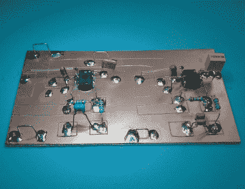

# 复古银石柜得到蓝牙待遇

> 原文：<https://hackaday.com/2018/07/30/vintage-silvertone-cabinet-gets-bluetooth-treatment/>

这款蓝牙音箱充满了令人愉悦的惊喜。外壳是一个古董收音机柜，但它实际上是空的内部是一个死虫电路和现代 BT 接收器的组合。

[PJ·艾伦]在 Groupon 上发现了 BT 接收器，并决定只用他已经有的零件来组装放大器和阈值检测器电路，以便制作出这个看起来复古的蓝牙扬声器。这个柜子是大约 1936 年的 Silvertone 1955 型的。别担心，没有古董在制作过程中受损，他买的时候柜子是空的。

LM4871 based amplifiers

每个扬声器一个放大器，最初是 TI lm 4871 数据手册中的一个电路。有些偏离是因为他没有准确的元件值，甚至没有并联电容来达到正确的范围。完成的电路板是一个令人愉快的混合[“死虫”和准曼哈顿风格的建筑](https://hackaday.com/2016/05/04/getting-ugly-dead-bugs-and-going-to-manhattan/)“准”，因为他划分了地平面，而不是在它上面放衬垫。

看橱柜的正面，你会看到一个长方形的显示屏。观看下面的视频，你会发现它随着音乐的节拍跳动。为了做到这一点，他提出了一种阈值检测电路，这种电路最初是基于 Sharp/Optonica 盒式磁带走带设备的电路，但他对其进行了改进。

然而，并不是所有的橱柜都是空的。看看这篇由我们自己的【Gregory L. Charvat】撰写的关于[修复这些美妙的旧收音机](https://hackaday.com/2014/09/09/welcome-to-the-old-school-restoring-antique-radios/)的帖子。

 [https://www.youtube.com/embed/HESnLMadgEw?version=3&rel=1&showsearch=0&showinfo=1&iv_load_policy=1&fs=1&hl=en-US&autohide=2&wmode=transparent](https://www.youtube.com/embed/HESnLMadgEw?version=3&rel=1&showsearch=0&showinfo=1&iv_load_policy=1&fs=1&hl=en-US&autohide=2&wmode=transparent)

