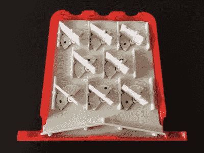

# 老式玩具通过 3D 打印得以延续

> 原文：<https://hackaday.com/2018/12/24/vintage-toys-live-on-through-3d-printing/>

我们对年轻时的玩具都有美好的回忆。多亏了易贝或现代复制品，其中大部分仍然很容易得到，但如果你童年的幻想不是主流呢？如果你最美好的回忆是玩 1960 年代的教育游戏，那会怎样？这些游戏现在已经很少见了，在二手市场上可以卖到数百美元。

Inside the *Think-a-Dot* replica

这就是[迈克·盖迪]最近发现自己的处境。看到那些帮助他走上漫长而有回报的软件开发职业生涯的教育游戏现在几乎找不到了，[他决定试着在他的 3D 打印机上重现它们。凭借他对细节的敏锐眼光和对这些令人难以置信的玩具的个人热爱，他将它们以数字形式保存下来，供后代欣赏。](https://www.instructables.com/id/The-Amazing-Dr-Nim-Scale-Model/)

他的复制品**神奇的尼姆博士*需要缩小一点，以便适合你的普通桌面 3D 打印机床，但在其他方面是原始注塑塑料计算机的忠实再现。最大的不同是，他的较小版本使用 10 毫米(3/8 英寸)的钢珠轴承而不是弹珠来驱动三个触发器，玩尼姆的古老游戏。*

 *[【Mike】还创造了一个*【Think-a-Dot】*](https://www.instructables.com/id/Think-a-Dot-Replica/)的复制品，这是另一个利用机械触发器来改变面板上八个圆点颜色的游戏。通过在游戏顶部的三个孔中投入弹珠，玩家可以改变圆点的颜色来创建各种图案。这个游戏的目的是找到最少数量的弹珠来重现手册中详细描述的特定图案。

说到这里，[Mike]附上了两款游戏手册的扫描件，并说他亲自把它们带到当地的一家商店进行专业印刷和装订，就像游戏最初出售时一样。因此，拥有这些经典“电脑”游戏的体验现在已经完全数字化，并随时可以根据需要被调用为有形形式。

这真的是一种保存实物的迷人方式，我们很有兴趣看看它是否会在其他玩具和游戏中流行起来，否则这些玩具和游戏可能会随着时间的流逝而消失。随着存储容量越来越大，我们将周围世界数字化的能力越来越强，我们怀疑越来越多的物理世界将会“备份”到互联网上。*