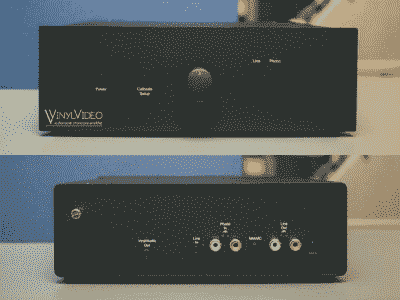

# VinylVideo 的字面意思是乙烯基上的视频

> 原文：<https://hackaday.com/2018/10/01/vinylvideo-is-literally-video-on-vinyl/>

人们常说，蚀刻在黑胶唱片中的音乐呈现出一种在数码唱片中找不到的超凡品质，但当你加入电影时，这种品质还适用吗？[sengüller 和 Diamant]的合作肯定是这样认为的，因为他们推出了他们的乙烯基视频前置放大器，为转盘提供了一种新的体验。这里没有磁带卷轴，这个项目展示了通过模拟视频的可能性。

而所有能回放 7 英寸的电唱机。45 RPM 与系统兼容，为了产生视频信号，乙烯基视频记录本身被特别切割。每张定制唱片在 A 面都有 4 分钟音乐视频的空间，在 B 面都有单曲的空间。视频以黑白、低于标准的清晰度和单声道音频播放，每秒约 12 帧。前置放大器通过 RCA 插孔或 3.5 毫米耳机插孔从常规音频电缆接收模拟信号，然后由 Raspberry Pi 型号 A+处理模数转换。视频输出选项包括 HDMI 和通过 3.5 毫米 TRSS 插孔的复合视频。

目前的乙烯基视频前置放大器实际上是 90 年代中期原始项目的改进，当时它是民间艺术展览的一部分。遗产网站(大约 1999 年)仍然是活的，所以你可以[访问它](http://www.vinylvideo.com/)。然而，为了获得最真实的体验，你可能需要启动一台装有网景导航器和 Real Player 的虚拟机。

为了更深入地了解乙烯基视频，下面有一个来自[Techmoan]的视频:

 [https://www.youtube.com/embed/UtNGVb94TFE?version=3&rel=1&showsearch=0&showinfo=1&iv_load_policy=1&fs=1&hl=en-US&autohide=2&wmode=transparent](https://www.youtube.com/embed/UtNGVb94TFE?version=3&rel=1&showsearch=0&showinfo=1&iv_load_policy=1&fs=1&hl=en-US&autohide=2&wmode=transparent)

