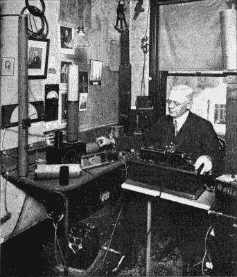
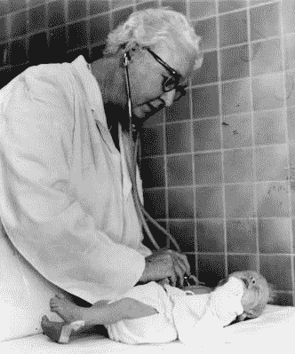
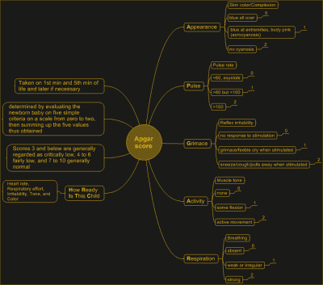
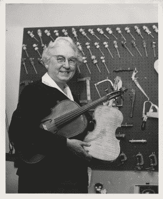

# 维珍尼亚·阿普伽可能救了你的命

> 原文：<https://hackaday.com/2021/07/13/virginia-apgar-may-have-saved-your-life/>

在 20 世纪 30 年代和 50 年代之间，美国发生了一些奇怪的事情。婴儿死亡率开始下降，但是出生后 24 小时内死亡的婴儿数量丝毫没有变化。这听起来很可怕，但在当时，许多呼吸不畅或表现出其他发育不良迹象的婴儿通常会被遗弃致死，并被记录为死产。

作为产科麻醉师、医生和医学研究者，维珍尼亚·阿普伽在观察新生儿和研究医生对他们的护理方面处于一个很好的位置。她因发明阿普加评分而闻名，该评分用于快速评估子宫外新生儿的生存能力。使用阿普加评分，根据心率、反射应激性、肌肉张力、呼吸努力和皮肤颜色对新生儿进行评估，并对每一类别给予 0-2 分。根据分数，婴儿将每五分钟被评定一次，以评估其进步情况。弗吉尼亚的方法至今仍在使用，并且挽救了许多被宣布为死产的婴儿。

弗吉尼亚从小就想成为一名医生，特别是外科医生。尽管弗吉尼亚以班级第四名的成绩从哥伦比亚大学内科和外科学院毕业，但外科主席不鼓励她成为一名外科医生，而是鼓励她多去学校学习一段时间，学习麻醉学。尽管这可能很不幸，但她可能永远也不会根据外科医生的时间表创造阿普加评分。

## 决心成为一名医生

Charles Apgar’s ham shack, including equipment he built. Image via [Wikipedia](https://en.wikipedia.org/wiki/Charles_E._Apgar)

维珍尼亚·阿普伽于 1909 年 6 月 7 日出生在新泽西州的韦斯特菲尔德，离纽约市约 20 英里。她是海伦·梅(克拉克饰)和查尔斯·埃默里·阿普加生的三个孩子中最小的一个。

她的父亲查尔斯是一名保险经理、业余天文学家、业余发明家和业余无线电爱好者，他的无线电工作揭露了一战期间的一个间谍网。阿普加对业余无线电产生了兴趣，因为他听到有人吹嘘在报纸印刷之前就获得了选举结果。他自己建造了大部分设备，并在战争开始前后录制了几次无线电广播，其中一些引起了他的怀疑。果然，他们来的那个车站属于德意志帝国。

弗吉尼亚的一个兄弟早年死于肺结核，另一个患有慢性疾病。当她 1925 年从韦斯特菲尔德高中毕业时，她决心成为一名医生。弗吉尼亚于 1929 年毕业于蒙特霍利约克学院，主修动物学，辅修生理学和化学。然后她去了哥伦比亚大学内科和外科学院，并于 1933 年以全班第四名的成绩毕业。四年后，她也在那里完成了外科住院医师培训。

## 医学神奇女侠

Virginia rates a fresh newborn. Image via [Wikipedia](https://commons.wikimedia.org/wiki/File:Virginia_Apgar.jpg)

尽管弗吉尼亚可能有资格和智慧成为一名外科医生，但有一样东西她没有——男性基因。附近一家医院的外科主任艾伦·惠普尔劝阻她不要追求外科医生的职业，仅仅是因为他看到一两个女人尝试过却失败了。惠普尔鼓励她转而从事麻醉学——一个相对较新的领域。

他相信推进麻醉学就是推进外科手术本身，他觉得她可以做出重大贡献。弗吉尼亚没有被吓倒，在威斯康星大学学习了六个月的麻醉学实习期，然后又在纽约市的贝尔维尤医院学习了六个月。

1938 年，弗吉尼亚回到哥伦比亚 P&S 大学，担任该校新成立的麻醉科主任。她有幸成为学校第一个领导任何部门的女性，同时也承担了很多责任。

弗吉尼亚在 20 世纪 40 年代做过行政人员、教师、征兵人员、协调员和执业医师。1949 年，她成为哥伦比亚大学 P&S 分校的第一位女性正教授，并一直呆到 1959 年。

## 阿普加评分

A mind-map of the Apgar scoring matrix. Image via [Wikipedia](https://en.wikipedia.org/wiki/Apgar_score)

她的部分工作是在分娩时提供麻醉，所以她花了相当多的时间在新生儿周围。在 20 世纪 50 年代的美国，每 30 个新生儿中就有一个在出生时死亡。弗吉尼亚下定决心要解决这个问题，尽管她真的无能为力。

她注意到，尽管婴儿死亡率在下降，但出生后 24 小时内的死亡人数保持不变。由于她能够观察许多新生儿并记录趋势，她想出了一种用简单的五点矩阵来评估新生儿活力的方法。

[阿普加评分](https://en.wikipedia.org/wiki/Apgar_score)是一个反义词，代表活动、脉搏、表情、外貌和呼吸。更具启发性的说法是，重点是评估婴儿的活动能力和意愿，加上其心率、易怒、肤色和呼吸。

婴儿出生时应该会哭——这有助于他们从呼吸粘液过渡到呼吸空气。一个不哭的婴儿会得到 0 分，而一个气喘吁吁的婴儿会得到 1 分，一个肺部健康的婴儿会得到 2 分。如果有必要，只要婴儿表现出进步，所有五项测试将以五分钟为增量再次进行。这种方法效果很好，很快许多医院将其作为标准程序实施。

弗吉尼亚与儿科医生、产科医生和其他麻醉医生合作，为使用阿普加评分的成功率建立了生理学基础。为了做到这一点，他们分析了婴儿的血液化学成分，以帮助将分数与分娩、分娩和母亲麻醉的影响相关联。

## 照亮先天缺陷

1959 年，弗吉尼亚离开了哥伦比亚 P&S 大学，在约翰霍普金斯卫生和公共卫生学院获得了公共卫生硕士学位。从 1959 年到 1974 年去世，她一直为“一角硬币进军基金会”工作，最终成为副主席。她还指导了致力于预防和治疗出生缺陷的研究项目。

Virginia with her tools and a few of the violins she made. Image via [National Institute of Health](https://profiles.nlm.nih.gov/spotlight/cp/catalog/nlm:nlmuid-101584647X52-img)

在她生命的这一阶段，弗吉尼亚还写作和演讲，每年旅行数千英里，以促进出生缺陷的早期发现和进一步研究的需要。1965 年，她成为康奈尔大学医学院的儿科临床教授，教授研究出生缺陷的畸形学。

## 许多人的名誉母亲

在她的职业生涯中，弗吉尼亚为各种报纸和杂志发表了几十篇科学文章和几篇外行水平的文章。她还与人合写了一本书，名为*我的宝贝还好吗？*这解释了常见的先天缺陷，旨在教准妈妈们如何预防这些缺陷的发生。

多年来，弗吉尼亚获得了许多奖项，包括三个荣誉博士学位。她从未结婚生子，但认为音乐是她生活的一大部分。在 20 世纪 50 年代，一位朋友向她介绍了制作乐器的艺术，他们一起制作了相当于弦乐四重奏的乐器——两把小提琴、一把中提琴和一把大提琴。

弗吉尼亚一生致力于帮助他人生活，她从未退休。她于 1974 年 8 月 7 日死于肝硬化。