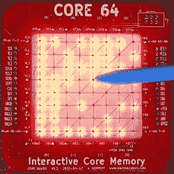

# 可视化带有磁芯 64 的磁性存储器

> 原文：<https://hackaday.com/2020/11/11/visualizing-magnetic-memory-with-core-64/>

对于我们大多数人来说，计算机内存是一个有点抽象的概念。无论你是在 Python 中声明一个变量还是在 Verilog 中设置一个寄存器，数据都会被送到某个地方，剩下的就不是你的问题了。您可能已经有意选择了要写入的确切地址，但它不像您可以瞥一眼一块 RAM 并看到数据。而且你几乎肯定不能用手重写。(如果你能做到这些，请告诉我们。)

这些限制肯定困扰着[安迪·格伯特]，因为他开始用他的[交互式记忆徽章核心 64](https://hackaday.io/project/166155-core-64-interactive-core-memory-badge)将计算机内存带入有形的(或至少是可见的)世界。[Andy]经历了几次不同的迭代，但 Core 64 本质上是一个 8×8 网格的编织核心内存，它通过磁极化来存储每一位，背后有一个 led 场，允许您可视化存储的内容。这种设置的真正美妙之处在于它可以用来显示 64 像素的图形。更好的是——通过在导线连接处引入磁场，可以重写一位。换句话说，把一根棍子上的磁铁扔进混合物中，你就有了一个小小的绘图板！

这[不是我们第一次看到使用核心内存](https://hackaday.com/2020/07/14/soviet-core-memory-experiments/)的很酷的实验，[也不是我们第一次看到【安迪】用它来做一些很棒的东西](https://hackaday.com/2018/04/28/core-memory-upgrade-for-arduino/)，但它确实阐明了这项技术是如何工作的。无论如何，不仅能看到内存被写入，还能手动写入，这让一切变得更加真实。

 [https://www.youtube.com/embed/FtNJ2jZhzoQ?version=3&rel=1&showsearch=0&showinfo=1&iv_load_policy=1&fs=1&hl=en-US&autohide=2&wmode=transparent](https://www.youtube.com/embed/FtNJ2jZhzoQ?version=3&rel=1&showsearch=0&showinfo=1&iv_load_policy=1&fs=1&hl=en-US&autohide=2&wmode=transparent)

