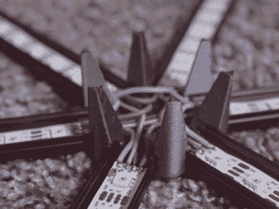

# 虚空之星的生命体征，视频显示

> 原文：<https://hackaday.com/2021/05/26/voidstars-vitals-visualized-for-video/>

对于[Voidstar Labs]的粉丝来说，这是一个好消息——[Zack]将在 YouTube 上直播未来的构建，而不是试图跟上每周发布一个构建视频的紧张而有限的计划。唯一的问题是，他身后的墙完全是空白和无聊的，这对于几乎任何不从热水浴缸中播放的流媒体来说都很重要。嗯，不再是了！[现在墙上有二十平方英尺的彩虹六边形](https://voidstar.dozuki.com/Guide/Chromance+Assembly+Instructions/6)，因为闪光灯。

 但这些可不是普通的闪光灯。它们信息丰富。他们随着[扎克]的生物指标的节拍跳舞，或者换句话说，他们在想象[扎克]在某个特定时刻可能有多出汗和焦虑，并将这些信息转化为艺术。

这一构建的核心是一个名为 EmotiBit 的全新生物测定板，它在一个小封装中拥有 16 个传感器，包括一个脉搏血氧计。EmotiBit 向[Zack]的电脑发送重要信息，电脑正在运行一个示波器应用程序来解释信号。然后，它们通过开放式声音控制发送到 ESP32，ESP32 运行灯光表演。

就像[扎克]在休息后的视频中说的，这不是一个非常困难的项目，但建设需要时间。[Zack]使用了用于橱柜下照明的铝挤压材料，并运行了 40 条，每条 14 个 DotStar LEDs。这些节点印在碳纤维 PLA 上，让灯远离墙壁，这样看起来更酷。担心当前的抽签结果？没关系，因为任何一个时间的发光二极管的亮度和数量都是有限的。再加上没有一个发光二极管被关闭的事实——它们每循环衰减 1%——你就有了一些非常酷的动画。休息后请继续关注。

想要一些本地化的闪光灯在镇上佩戴吗？把你的心穿在袖子上，让他们看看你在健身房有多努力。

 [https://www.youtube.com/embed/g6n8XLmZ__I?version=3&rel=1&showsearch=0&showinfo=1&iv_load_policy=1&fs=1&hl=en-US&autohide=2&wmode=transparent](https://www.youtube.com/embed/g6n8XLmZ__I?version=3&rel=1&showsearch=0&showinfo=1&iv_load_policy=1&fs=1&hl=en-US&autohide=2&wmode=transparent)

