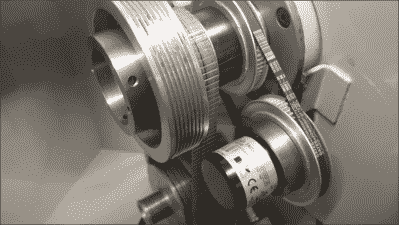

# AR 显示器实时显示数控车床操作

> 原文：<https://hackaday.com/2022/02/16/vr-display-shows-cnc-lathe-operations-in-real-time/>

[Kent VanderVelden]想出了一个有趣的 [AR 系统来帮助监控数控车床](https://www.youtube.com/watch?v=Bqa2grG0XtA)的操作员。(视频，嵌入式，如下)想法是首先产生工件的‘冻结’视频流。这是通过在车床上方放置高速摄像机，并触发图像捕捉，与工件的旋转位置同步来实现的。高速旋转编码器通过皮带驱动连接到尾座，将当前位置输入 Altera Terasic DE-Nano FPGA 评估板。然后将其与另一个编码器的位置进行比较，作为角度设定点控制。由此产生的信号被用作相机触发器，以生成仅由操作者选择角度的帧构成的视频流，从而给出冻结位置的印象。视频流被发送到带有 UPS 帽子的基于 Raspberry Pi 4 的客户端设备，从而允许它是便携的。

High speed rotary encoder driven via a belt

该视频流覆盖了当前机器位置的详细信息，以及正在执行的 LinuxCNC G 代码和机器正在执行的操作的图形表示。这个组合视频然后被传送到一个可穿戴的 [Vufine VUF-110](https://store.vufine.com/) 设备，这是一种微创设备，允许操作者清楚地看到感兴趣的机器。正如[Kent]所建议的，这种设置有许多可能的使用场景，包括由一个操作员远程监控多个操作机器。

这些年来，我们已经看到了一些整洁的机器黑客，这里有一个很好的项目，为一台旧车床添加了一个可编程的动力进给系统，而且由于木车床经常错过一些 DRO 的爱，这里有一个告诉他们你关心 T3 的好方法。

 [https://www.youtube.com/embed/Bqa2grG0XtA?version=3&rel=1&showsearch=0&showinfo=1&iv_load_policy=1&fs=1&hl=en-US&autohide=2&wmode=transparent](https://www.youtube.com/embed/Bqa2grG0XtA?version=3&rel=1&showsearch=0&showinfo=1&iv_load_policy=1&fs=1&hl=en-US&autohide=2&wmode=transparent)

