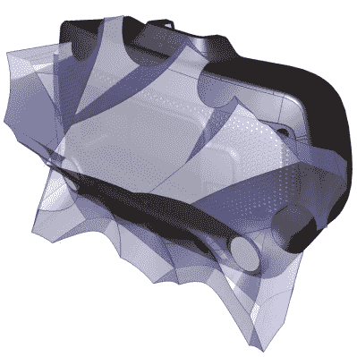

# 想要支持对黑客友好的硬件设计？以 Valve 为例

> 原文：<https://hackaday.com/2020/08/20/want-to-support-hacker-friendly-hardware-design-follow-valves-example/>

距离 Valve 发布他们的旗舰 VR 系统 Index 已经过去一年多了，值得回顾一下这个 GitHub 知识库，它是如何为黑客友好的硬件设计提供支持材料的一个很好的例子。上图展示了一个对黑客友好的设计元素:遮阳板后面的一个空白空间，右边有一个 USB 端口，它的存在只是为了更容易安装和插入任何人可能想到的东西。然而，事情远不止如此。如果有人希望为硬件设计提供支持材料，他肯定会比模仿 Valve 的例子做得更糟。

The violet 3D model shows the area that modifications can occupy without getting in the way of any sensors.

硬件库不仅包含 mod 友好硬件的 CAD 模型(高分辨率 STEP 模型和 STL 文件),还包含传感器区域的 3D 模型，因此 modders 可以确保他们的作品不会遮挡任何传感器。例子很多，Valve 提供的一个是*助推器*；手控制器附件，为手大或拇指长的人提供额外的舒适。该模型还兼作设计不会干扰控制器的任何跟踪或触摸敏感表面的附件的参考。

对黑客友好并不意味着硬件没有保修，但它确实意味着有具体的指导，什么可以或不可以使它无效。在索引硬件的情况下，指导很简单:“任何需要 T5 或更小的硬件都是用户不可维修的。”

对我们来说，对黑客友好的整个态度可以通过一个关于 headstrap 的声明来体现，这个声明可以在页面的中间找到。“不建议移除头带”这几个字之后紧接着是[关于如何做到这一点的明确指示](https://hackaday.com/2019/12/16/prusa-dares-you-to-break-their-latest-printer/)，展示了减少附加和修改障碍所必需的信任。这是一个帮助培养实验的好方法，就像[这个将物理元素 1:1 映射到虚拟现实元素的项目，来制作令人敬畏的宇宙飞船驾驶舱](https://hackaday.com/2019/09/25/tinker-pilot-project-cranks-cockpit-immersion-to-11/)。