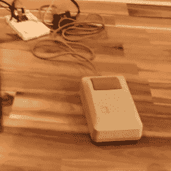

# 想要在现代电脑上使用经典的 Mac 鼠标吗？没有吗？以下是如何做到这一点

> 原文：<https://hackaday.com/2022/08/11/want-to-use-a-classic-mac-mouse-on-a-modern-computer-no-heres-how-to-do-it-anyway/>

需要在 DIY USB 适配器的帮助下将经典 Mac 鼠标连接到您的现代机器上吗？[【约翰·弗洛伦】你报道过](https://jfloren.net/b/2022/7/8/0)吗？[John]的解决方案使用一个带有 ATmega32U4 微控制器的电路板，一端连接到 Mac 鼠标，另一端模拟 USB HID(人机接口设备)。因此，现代机器可以像识别任何其他 USB 输入设备一样识别它。

 为什么有这个必要？经典 Mac 鼠标上的连接器可能看起来像熟悉的 DE-9 连接器，但它不是 RS-232 设备，如果插入 9 针串行端口，它将无法工作。经典的 Mac 鼠标使用不同的引脚排列，内部没有多少大脑空间。它依赖主机直接读取其编码器和按钮状态。

这个项目实际上是对[John]在[所做的早期工作的一点更新，使一个老式的 Depraz 鼠标与现代系统一起工作](https://hackaday.com/2021/08/09/this-old-mouse-building-a-usb-adapter-for-a-vintage-depraz-mouse/)。他怀疑让它也适用于经典的 Mac 鼠标并不需要太多，他是对的——只需要更新引脚连接和添加一些上拉电阻。[源代码和设计文件在 GitHub](https://github.com/floren/depraz-arduino) 上。

即使一个人并不特别想在日常工作中使用经典的 Mac 鼠标，这种东西对那些经营老式硬件的人来说肯定是有价值的:它允许一个人在不启动老式机器的情况下检查旧外设的功能。

 [https://www.youtube.com/embed/wK_6Q12CK_c?version=3&rel=1&showsearch=0&showinfo=1&iv_load_policy=1&fs=1&hl=en-US&autohide=2&wmode=transparent](https://www.youtube.com/embed/wK_6Q12CK_c?version=3&rel=1&showsearch=0&showinfo=1&iv_load_policy=1&fs=1&hl=en-US&autohide=2&wmode=transparent)

