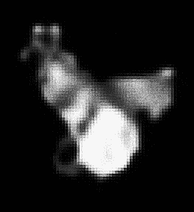
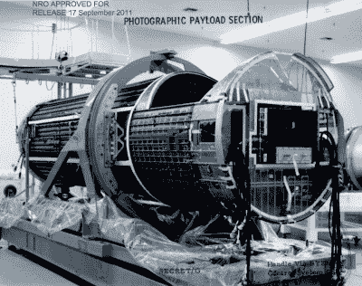
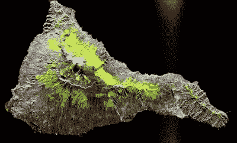

# 观察守望者:太空监视的状态

> 原文：<https://hackaday.com/2019/09/12/watching-the-watchers-the-state-of-space-surveillance/>

现在，你几乎肯定已经听说了最近发布的高分辨率卫星图像，该图像显示了伊朗发射 Safir 液体燃料火箭失败的后果。伊朗发展这种弹道导弹技术的地缘政治影响本身当然是一个有新闻价值的故事，但在这种情况下，人们对照片是如何拍摄的更感兴趣。鉴于已知的变量，如事件发生的时间和日期以及发射台的位置，分析师们已经确定它很可能是由一颗机密的美国 KH-11 卫星拍摄的。

这张图像的确令人震惊，显示的细节水平远远超过了我们作为平民所能获得的任何空间观测服务。估计是从大约 382 公里的距离拍摄的，该图像的分辨率似乎至少为每像素 10 厘米。鉴于该卫星的轨道在最接近地球表面时低至 270 公里，最大分辨率可能更高。

当然，KH-11 卫星的许多方面仍然是高度机密的，特别是关于最新的硬件修订。但是它们的存在和一般设计已经是几十年前的常识了。从上一代 KH-11 卫星拍摄的图像在 20 世纪 80 年代和 90 年代被泄露或以其他方式发布，尽管伊朗的图像肯定具有更高的保真度，但考虑到中间的几十年，这并不完全令人惊讶。

我们对取代 KH-11 的轨道监视设备知之甚少。拍摄这张照片的卫星名为 USA 224，自 2011 年以来一直在轨道上运行。自那以后，美国国家侦察局(NRO)已经发射了许多更新的航天器，从现在到 2021 年，还将有更多的航天器被送入轨道。

因此，让我们仔细看看 KH-11 系列侦察卫星，并将其与我们能够拼凑出的下一代或已经在头顶盘旋的轨道间谍技术进行比较。

## 特工哈勃

Hubble Space Telescope

KH-11“KENNEN”卫星旨在替代 20 世纪 60 年代开发的基于胶片的 KH-9“HEXAGON”卫星。从这些旧卫星上恢复图像需要使用小胶囊，这些小胶囊将重新进入地球大气层，并在半空中被等待的飞机捕获；一个缓慢、复杂且昂贵的过程。相比之下，KH-11 的数字技术意味着图像可以通过通信卫星网络近乎实时地传输。

但是尽管第一架 KH-11 早在 1976 年就发射了，却从来没有一张公开发布的照片。幸运的是，分析家们相当清楚这些卫星的样子，因为它们碰巧有一个非常著名的近亲:哈勃太空望远镜。两个太空卡塞格林反射望远镜都是由洛克希德公司建造的，根据美国宇航局的官方记录，哈勃的一些设计元素(如主镜的 2.4 米直径)是为了“通过使用为军事间谍卫星开发的制造技术来降低制造成本”。

Amateur image taken in 2010

家族相似也不仅仅是猜测。在 2010 年和 2015 年，[天体摄影师 Ralf Vandebergh 能够使用业余爱好者级别的设备直接拍摄两颗独立的 KH-11 卫星](http://www.ralfvandebergh-astrophotography.simpsite.nl/space-telescopes-keyhole)。尽管他的技术手段相对较低，但他还是能够抓拍到这些神秘的航天器，这似乎证实了他们的设计与哈勃非常相似的猜测。

在像素化的图像中，我们可以看到相同的锥形形状和望远镜末端似乎是一个孔径门。KH-11 还具有至少一个像哈勃一样的太阳“翅膀”,在另一侧可能有某种类型的定向天线阵列；尽管拉尔夫说这可能只是光线的恶作剧。

就大小而言，由于共享的镜子，KH-11 几乎肯定与哈勃的直径相同，但传言称它没有那么长。较短的焦距将使 KH-11 拥有比哈勃更宽的视野，这将更适合观察地面。

## 尽善尽美

如果一个拥有消费设备的人可以识别、跟踪和拍摄两颗 KH-11 卫星，那么其他国家的情报机构也有类似的壮举是合情合理的。任何技术先进的国家都会被头顶上这些卫星的出现而措手不及，这种想法似乎是不太可能的。

当然，知道他们在上面并不等同于知道他们实际上能看到什么。但事实证明，这个问题也不难回答。使用瑞利标准可以计算望远镜的角分辨率，瑞利标准考虑了要观察的波长和透镜孔径的直径。当结合卫星在观测时的高度时，角分辨率可以告诉我们，在像 KH-11 这样的光学望远镜从太空中实际看到一个物体之前，它需要多大。

The KH-8 GAMBIT was capable of similar resolution

使用 2.4 米的镜子观察 500 纳米的标称波长，瑞利标准告诉我们，望远镜应该具有大约 0.05 弧秒的衍射极限分辨率。在 250 公里的高度，这相当于大约 6 厘米(2.4 英寸)的表面分辨率。请记住，这是一个理论上的最大值，实际上，由于大气不稳定以及卫星不太可能位于目标正上方的事实，分辨率会更低。伊朗的图像分辨率估计为 10 厘米，因此完全在 KH-11 的计算性能范围内。

同样，对于任何潜在的对手来说，运行这些数字并意识到 KH-11 能够看到什么并不困难。尤其是美国已经在这个物理分辨率极限下运行监视卫星 50 多年了。KH-8“GAMBIT”是 1966 年首次发射的胶片监视卫星，在理想条件下也能够分辨 5 至 10 厘米的物体。

## 下一代

1966 年的美国监视卫星的分辨率与 2019 年飞行的卫星相当，这似乎有点奇怪，特别是自那以来技术已经发生了很大变化。但最终，这些都是大型光学望远镜，而控制它们性能的物理学早在任何人梦想将它们送上太空之前就被发现了。自 1960 年代以来，围绕望远镜的其他航天器当然也在发展，推进能力、数据吞吐量、能耗和续航能力都有所提高；但是今天一面 2.4 米的镜子将会和 50 年前甚至 100 年前一样工作。

Synthetic-aperture radar image taken from space

如果光学望远镜的能力已经达到了物理极限，那么我们将何去何从？提高这些卫星性能的最显而易见的方法是使用图像增强软件。由于计算性能在过去十年中取得的飞跃，望远镜拍摄的图像可以数字化地锐化和清理。这可能是为什么伊朗的图像看起来比 20 世纪 90 年代发布的 KH-11 照片更清晰，即使望远镜的实际分辨率没有根本改变。

除此之外，据信较新的侦察卫星，如 2019 年 1 月发射的 NROL-71，可能会用[其他传感技术，如合成孔径雷达(SAR)](https://hackaday.com/2014/03/17/radar-imaging-in-your-garage-synthetic-aperture-radar/) 增强或完全取代它们的光学望远镜。与光学卫星相比，雷达成像卫星有许多优势，例如在夜间和恶劣天气下观察目标的能力。在实验室环境中，合成孔径雷达已经实现了亚毫米分辨率，尽管从数百公里外观察目标时，真实世界的精度肯定会更低，但它有可能将轨道监视超越自冷战期间第一颗“间谍卫星”上天以来就存在的物理限制。