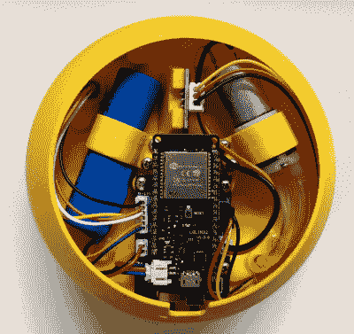

# 一年给你的植物浇四次水

> 原文：<https://hackaday.com/2022/05/19/water-your-plants-just-four-times-per-year/>

虽然有些植物确实因无人照管而茁壮成长，但只要光照水平合适，许多植物只要每周浇一次几盎司水就能生长得很好。但即使是这样，在我们这个前所未有的时代，也有足够多的事情需要记住和实际去做，所以为什么要费心去尝试呢？[Martin]为我们解决了这个问题，对自动植物护理的每个方面都进行了大量思考。他努力的结果是 [Flaura，一个自动浇水的开源花盆](https://www.youtube.com/watch?v=rHHFL17ncnc)和[一个与之配套的 YouTube 频道](https://www.youtube.com/channel/UCAtCwTQljeSkqKOKZ6kRAbg)。

 这种 3D 打印的花盆可以很容易地放大或缩小，以适应植物的大小，并包含一个默认大小约为 0.7 升的蓄水池。只要通过这个小喷嘴把它倒进去，你就可以用大约三个月，这取决于植物，它所在的光线，以及它吸取的水的多少。你可以在配套的应用程序中跟踪干燥度。

每当隐藏在泥土底部的电容式土壤湿度传感器检测到干旱情况时，它就会通过 Wemos LOLIN32 和一个 MOSFET 向一个小泵发送信号，从水库中抽水。

土壤由一根布满数十个小孔的小软管均匀浇水，这些小孔产生低压水射流。这绝对是这个项目中我们最喜欢的部分——不仅仅是因为它看起来很酷，还因为很多这种类型的建筑总是在同一个地方放水。。。不是我们如何浇灌我们的植物。请务必在休息后观看项目概述视频。

没有打印机？没问题— [只要水泵还能用，你总是可以用一台旧的克里格机器](https://hackaday.com/2020/04/23/coffee-maker-gives-plants-an-automatic-drip/)来浇灌一株植物。

 [https://www.youtube.com/embed/rHHFL17ncnc?version=3&rel=1&showsearch=0&showinfo=1&iv_load_policy=1&fs=1&hl=en-US&autohide=2&wmode=transparent](https://www.youtube.com/embed/rHHFL17ncnc?version=3&rel=1&showsearch=0&showinfo=1&iv_load_policy=1&fs=1&hl=en-US&autohide=2&wmode=transparent)

谢谢你的提示，[基思]！