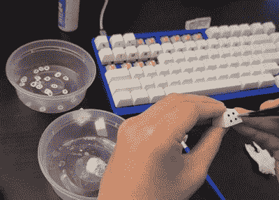

# Wingding 键帽的滑水贴花

> 原文：<https://hackaday.com/2021/06/12/waterslide-decals-for-wingding-keycaps/>

我们太了解这种感觉了。]花了 340 美元建造，陆兵，并拍摄了一个定制键盘，但直到他们把键帽分类后，它仍然不完美。他们买空白的帽子，因为它们很棒，但也因为他们想为所有那些辛辛苦苦润滑和拍摄的盖特伦黄色制作他们自己的定制帽子。起初【YOHON！考虑过用直发器和聚酰亚胺胶带 DIY 染料升华风格，但这种方法太持久了。反而，【YOHON！]想要试验、改变和犯错的空间。

 [最终，【YOHON！]了解了滑水道贴花，并决定这样做](https://www.reddit.com/r/MechanicalKeyboards/comments/nncx59/how_to_diy_custom_print_keycaps_using_waterslide/)。每一步听起来都很艰难，但我们认为这是值得的，因为这些看起来很棒。自从【YOHON！]想让键盘变得奇怪，他们为每个键设计了一个可爱的小符号，给它一种神秘但可访问的 Wingdings 感觉。

我们认为这些象形图都非常可爱，我们特别喜欢代表 O 的猫头鹰，代表 V 的火山，当然，代表 X 的骷髅也是不错的选择。哦，还有一个小小的烦躁旋钮来圆可爱。设计和应用键帽花费的时间比整个键盘制作要长，但是你可以在休息之后看看加速版。

想在键帽问题上砸钱吗？你可能不想要一整个键盘都是芝士汉堡和热狗键帽，但是有一两个有趣的键帽就很酷了。如果你想让你的定制键帽更持久，并且不喜欢染料升华的把戏，试试 [3D 打印它们](https://hackaday.com/2021/03/02/3d-printed-macro-pad-ditches-the-pcb-with-slick-wiring-guides/)。

 [https://www.youtube.com/embed/bnU0FQforaw?version=3&rel=1&showsearch=0&showinfo=1&iv_load_policy=1&fs=1&hl=en-US&autohide=2&wmode=transparent](https://www.youtube.com/embed/bnU0FQforaw?version=3&rel=1&showsearch=0&showinfo=1&iv_load_policy=1&fs=1&hl=en-US&autohide=2&wmode=transparent)

通过 [KBD](https://kbd.news/Custom-keycaps-using-waterslide-decals-700.html)