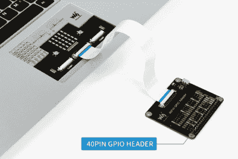

# Waveshare 的 Pi CM3 笔记本电脑来得有点晚

> 原文：<https://hackaday.com/2020/12/03/waveshares-pi-cm3-laptop-arrives-a-bit-too-late/>

好消息是，你现在可以[购买一台基于 Raspberry Pi 计算模块(CM)](https://www.waveshare.com/pilaptop-cm3-plus-package-a.htm) 的相当不错的笔记本电脑。坏消息是，它是在任何人都知道新 CM4 的接口将发生变化之前构思的，所以它没有任何使它真正有趣的功能，如支持 PCI-Express。哦，它值 300 美元。

我们大多数人最熟悉的电子纸显示器供应商 Waveshare 公司也在他们的笔记本电脑上做出了一些相当有趣的设计选择。看到键盘下面的黑色小键盘了吗？不，这不是触控板。它只是一个装饰性的盖子，您可以移除它来访问 LED 矩阵和 GPIO 连接器。毫无疑问，正面带有 GPIO 接口的笔记本电脑绝对是我们的首选。但是决定安装它来代替触控板，然后用看起来完全像触控板的东西覆盖它，老实说，这很奇怪。这可能并不漂亮，但[Pi 400 似乎已经很好地解决了这个问题](https://hackaday.com/2020/11/02/new-raspberry-pi-400-is-a-computer-in-a-keyboard-for-70/)，没有任何混乱。

 另一方面，这款产品似乎有很多让人喜欢的地方。首先，这是一款非常时尚的机器，没有其他商用 Pi 笔记本电脑常见的四四方方、有点稚气的外观。我们还喜欢 Waveshare 包括一个合适的以太网插孔，这种插孔即使在“真正的”笔记本电脑上也变得越来越罕见。正如[ETA PRIME]在休息后的视频中指出的那样，该机还拥有清晰的 IPS 显示屏和反应惊人的键盘。尽管它仍然有一个“Windows”键，但考虑到它的成本，这一点有点令人不快。

但实际上，这款笔记本电脑最大的问题是它最终上市的时间。如果 Waveshare 在 CM3 首次推出时就推出了这一技术，它可能会是一项更令人印象深刻的技术成就。另一方面，如果他们再多等一会儿，他们就能围绕能力更强的 CM4 来设计它。就目前的情况来看，产品尴尬的卡在了中间。

 [https://www.youtube.com/embed/Diye87WDOeA?version=3&rel=1&showsearch=0&showinfo=1&iv_load_policy=1&fs=1&hl=en-US&autohide=2&wmode=transparent](https://www.youtube.com/embed/Diye87WDOeA?version=3&rel=1&showsearch=0&showinfo=1&iv_load_policy=1&fs=1&hl=en-US&autohide=2&wmode=transparent)

【感谢 Sathish 的提示。]