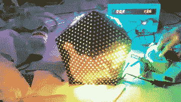

# 我们被巨石击倒了

> 原文：<https://hackaday.com/2019/11/08/we-are-bowled-over-by-the-bouled/>

我们最近已经看到了很多立方体 LED 作品，但这一个更进了一步。 [BouLED 是一个正在开发中的二十面体 LED 显示屏](https://rose.telecom-paristech.fr/2019/bouled)，一个由 20 个平坦的三角形 LED 照明面组成的类似地球的球体。当与显示器内部的传感器结合时，它将能够稳定图像。换句话说:你可以拿起它并旋转它，但图像将保持稳定。这是巴黎电信学校的学生[Matthias Rabault]、[Lucas Lebailly]和[Hichem Ghandri]作为学位工作的一部分创作的。

到目前为止，这个团队组装的原型是一个漂亮的东西，看起来工作得很好。每个三角形基本上都是一长串发光二极管，面板连接到运行整个事情的 STM32H7 控制器。还有一个将设备连接到 WiFi 的 ESP32。

 [https://www.youtube.com/embed/4hMvRfeZwco?version=3&rel=1&showsearch=0&showinfo=1&iv_load_policy=1&fs=1&hl=en-US&autohide=2&wmode=transparent](https://www.youtube.com/embed/4hMvRfeZwco?version=3&rel=1&showsearch=0&showinfo=1&iv_load_policy=1&fs=1&hl=en-US&autohide=2&wmode=transparent)

从最初的设计到他们现在拥有的第一个运行原型，仔细阅读各个阶段以了解项目是如何发展的也是值得的。该团队做了很多迭代设计，包括尝试 3D 打印和激光切割，然后他们为三角形表面提出了最终的 PCB 设计，并开始建造它。他们做出的一个有趣的选择是投入大量工作编写一个模拟器，因为他们意识到这可以用于最终确定将图像翻译到显示器上的算法，并驱动最终版本。

