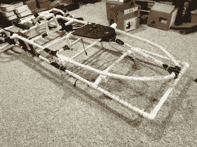

# 可穿戴的飞车自行车已经为夜晚外出做好准备

> 原文：<https://hackaday.com/2018/12/07/wearable-speeder-bikes-are-ready-for-a-night-out/>

虽然 Hackaday 与时尚博客相去甚远，但我们不得不承认，我们绝对喜欢[bithead 942]2018 冬季系列。他的妻子和女儿最近[开始为他最新的必备设计制作模型:可穿戴的*星球大战*飞车](https://bithead942.wordpress.com/2018/11/24/speeder-bikes/)；从休息后的视频来看，他们肯定是感恩节游行中穿着最好的。

【bithead 942】通过仔细测量他妻子拥有的老式飞车模型套件开始建造，这可以准确地重现在*绝地归来*中看到的车辆的标志性外观。但是，为了公平起见，最终的“自行车”需要大约 3 米(10 英尺)长，这立即带来了一个问题。什么样的材料可以支撑这么长时间，同时又足够轻，可以长时间穿着？

像往常一样，答案来自当地的五金店。他发现 Schedule 80 和 40 PVC 管的组合是一种完美的材料:足够坚固以支撑所需的尺寸而不弯曲，足够轻以至于最终的自行车穿着不会不舒服，受热容易弯曲，也许最好的是，便宜且容易获得。然后在 PVC 框架上覆盖铁丝网和柔软的薄泡沫，让它看起来饱满而不沉重。

尽管[bithead942]对重量有严格的限制，但他还是忍不住添加了一些电子设备来完成这一效果。LED 装饰控制面板允许女士们触发 Adafruit Mini FX 声卡上存储的电影的不同音效，该声卡连接到 20W 类放大器和一对 400 瓦的汽车立体声扬声器。他说，由此产生的回放声音足够大，在游行期间可以听到外面的声音，而且只增加了几磅的整体重量。

这些可能是你正在寻找的自行车，但[它们肯定不是我们在 Hackakday](https://hackaday.com/2017/11/08/the-star-wars-speeders-finishing-touch-mirrors/) 上展示的第一辆。与此同时，在设计你的下一个项目时，你最好不要低估这种不起眼的 PVC 管。[从为你的 Dremel](https://hackaday.com/2017/03/31/make-a-pvc-drill-press/) 组装的钻床到为你和你最亲密的十几个朋友建造的[天文馆，有了这些丰富的材料，你几乎可以建造任何东西。](https://hackaday.com/2018/03/12/diy-planetarium-built-from-pvc-pipes-and-cardboard/)

 [https://www.youtube.com/embed/dhzLiq5V5vw?version=3&rel=1&showsearch=0&showinfo=1&iv_load_policy=1&fs=1&hl=en-US&autohide=2&wmode=transparent](https://www.youtube.com/embed/dhzLiq5V5vw?version=3&rel=1&showsearch=0&showinfo=1&iv_load_policy=1&fs=1&hl=en-US&autohide=2&wmode=transparent)

