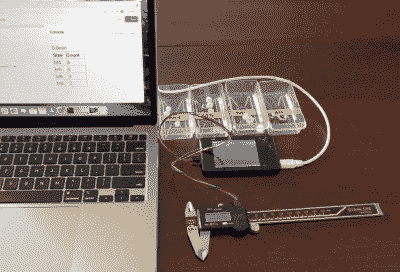

# 以网络为中心的加布伊诺有编译器，会旅行

> 原文：<https://hackaday.com/2022/01/23/web-centric-gabuino-has-compiler-will-travel/>

可以说，Arduino 平台的最大优势是其易用性，尤其是与引入开源板及其相关软件开发环境之前的微控制器开发相比。你所需要做的就是下载适合你的平台的 IDE，插入你的 Arduino，然后你只需要点击几下鼠标就可以让代码在硬件上运行了。

但是它能变得更容易吗？[Gabriel Valky]当然是这么认为的，[这也是他开发基于云的 Gabuino 平台](https://github.com/gabonator/LA104/tree/master/system/apps_featured/117_gabuino)的原因。截至目前，它只支持 DS213 袖珍示波器和 LA104 逻辑分析仪，但他说，代码足够轻便，应该可以与任何具有适当引导加载程序的 STM32 板一起工作。使用 Gabuino 不需要在电脑上安装任何软件，只要插上主板，你就已经成功了一半。

Gabuino processing data from digital calipers.

诀窍在于，代码编辑器和编译器已经被移到云中，并通过主机的网络浏览器访问。web 界面还集成了一个令人印象深刻的“控制台”，它[Gabriel]将其比作 Arduino IDE 的串行监视器和绘图仪功能，但实际上功能更强大。Gabuino 控制台不仅是双向的，而且通过使用 Three.js 和 WebGL 等库，它能够从微控制器上运行的代码中呈现视频输出。

[Gabriel]在下面的视频中向我们展示了 Gabuino 的一些功能，我们不得不说，它看起来令人印象深刻。我们尤其喜欢内置的调试功能，它允许您设置断点和检查变量。这种即插即用的方法对学生或初学者来说肯定是有希望的，尽管我们认为在项目真正启动之前，硬件兼容性还需要一些工作。

顺便说一下，这不是[Gabriel]第一次为 LA104 写代码了。[去年，我们报道了他令人印象深刻的定制固件](https://hackaday.com/2020/10/01/teaching-a-pocket-logic-analyzer-many-new-tricks/),这是一款 100 美元左右的小玩意，如果你最终得到一个来试验 Gabuino，这应该会大大增加交易的甜头。

 [https://www.youtube.com/embed/XhIkEYYnNi4?version=3&rel=1&showsearch=0&showinfo=1&iv_load_policy=1&fs=1&hl=en-US&autohide=2&wmode=transparent](https://www.youtube.com/embed/XhIkEYYnNi4?version=3&rel=1&showsearch=0&showinfo=1&iv_load_policy=1&fs=1&hl=en-US&autohide=2&wmode=transparent)

