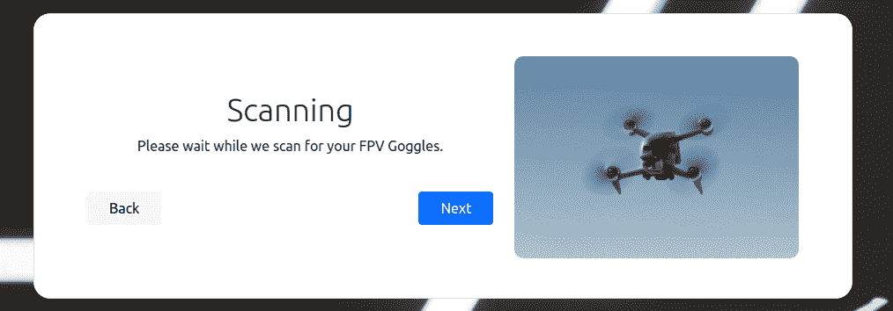

# 网络工具提高了 DJI FPV 无人机的功率

> 原文：<https://hackaday.com/2021/03/31/web-tool-cranks-up-the-power-on-djis-fpv-drone/>

显然，如果你崭新的 DJI·FPV 无人机上的全球定位系统检测到它不在美国，它就会降低发射功率，以免与全球其他地方更严格的无线电限制相冲突。因此，尽管所有在月球上放靴子的国家都可以享受硬件能够提供的 1412 兆瓦的电力，但无人机的软件将其他人限制在微不足道的 25 兆瓦。正如您所想象的，这导致了在范围方面相当大的性能损失。

但现在不是了。一个名为 B3YOND [的网络工具承诺，无论你住在哪里，都可以通过欺骗让你的 DJI FPV 无人机相信它在美国，从而恢复它的全部功能。由[D3VL]的团队开发的解锁工具使用新的 Web 串行 API，通过 USB 向无人机的 FPV 护目镜发送适当的“FCC 模式”命令。一切都是自动化的，因此任何运行最新版本 Chrome 或 Edge 的人都可以使用这种技术，只需点击几次按钮。](https://d3vl.com/portfolio/b3yond/)

目前还没有可用的源代码，尽管页面上确实提到他们将很快建立一个 GitHub 库。与此同时，[D3VL]已经记录了需要通过类似 MODBUS 的串行协议发送到无人机的命令包，供其他可能想要推出自己的解决方案的人使用。目前也有一个离线的 Windows 专用工具可供下载，听起来 Mac 和 Android 的独立版本也在开发中。

不言而喻，如果你需要使用这个工具，你可能会违反一些法律。在许多欧洲国家，25 mW 是无人机允许的最大未经许可的发射机功率，所以在你打开开关之前，一定要记住这一点。Hackaday 的业务不是提供法律建议，但也就是说，我们不想被发现以接近 60 倍于法律限制的速度发送信息。

即使你对摆弄无人机无线电不感兴趣，看看 Web 串行 API 的另一个实际应用也很有趣。[从即兴示波器](https://hackaday.com/2021/02/22/slick-web-oscilloscope-is-ready-in-a-flash-literally/)到与开发板和会议徽章通信的，聪明的开发者已经找到了利用这一新功能让硬件黑客攻击变得更容易的方法。

感谢朱尔斯的提示。]