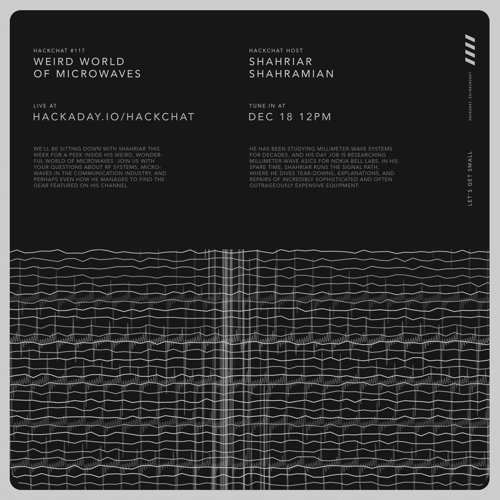

# 微波黑客聊天的怪异世界

> 原文：<https://hackaday.com/2019/12/16/weird-world-of-microwaves-hack-chat/>

加入我们太平洋时间 12 月 18 日星期三中午与 Shahriar Shahramian 的[怪异微波黑客世界聊天](https://hackaday.io/event/167683-weird-world-of-microwaves-hack-chat)！多年来，我们一直在信号路径上跟踪他的*,并很兴奋地在这个通常被认为是电子黑艺术之一的领域挖掘他的智慧。*

不管你对电子学了解多少，似乎总有另一扇门可以打开。你以为学了基本电路就知道一二了，然后发现射频电路。事情开始变得有点奇怪，随着波长的减少，你开始进入微波波段，事情变得更加奇怪。在这里，馈线变成了波导，PCB 走线充当元件，天线看起来更像乐器。

Shahriar 对这片土地并不陌生。几十年来，他一直在研究毫米波系统，他的日常工作是为晶体管的诞生地新泽西的诺基亚·贝尔实验室研究毫米波 ASICs。在他的业余时间，Shahriar 经营着 Signal Path，一个受欢迎的[博客](http://thesignalpath.com/blogs/)和 [YouTube 频道](https://www.youtube.com/channel/UCKxRARSpahF1Mt-2vbPug-g)，在那里他对[极其复杂的](https://hackaday.com/2017/09/27/lock-in-amplifiers/)和通常[极其昂贵的](https://hackaday.com/2018/09/24/tearing-into-a-1-3-million-oscilloscope/)设备进行拆卸、解释和维修。

本周，我们将与 Shahriar 坐下来进行 2019 年的最后一次聊天，一窥他怪异、奇妙的微波世界。请加入我们，向我们提问有关 RF 系统、通信行业中的微波，甚至他是如何找到他的频道中的特色设备的。

 我们的黑客聊天是 [Hackaday.io 黑客聊天群发消息](https://hackaday.io/messages/room/2369)中的社区直播活动。本周，我们将于太平洋时间 12 月 18 日星期三中午 12:00 坐下来讨论。如果时区让你烦恼，我们有[一个方便的时区转换器](https://www.timeanddate.com/countdown/generic?iso=20191218T12&p0=224&msg=Weird+World+of+Microwaves+Hack+Chat&font=cursive)。

点击右边的那个发言气泡，你会被直接带到 Hackaday.io 上的黑客聊天群，不用等到周三；随时加入，你可以看到社区在谈论什么。

