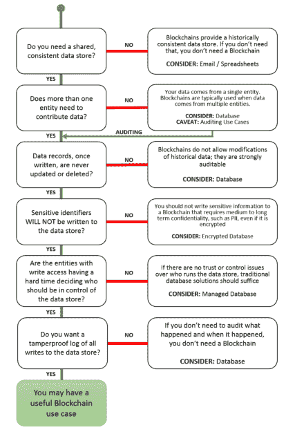

# 区块链能为你做什么？

> 原文：<https://hackaday.com/2018/10/25/what-can-the-blockchain-do-for-you/>

想象你是一位将军，带着你的军队在一座设防的城市外扎营。你的军队没有足够的力量在没有帮助的情况下占领这座城市。但是你得到了帮助:在城外的其他山上驻扎着半打以上的将军，他们的军队随时准备进攻。一次进攻一支军队会失败；占领这座城市至少需要三到四支军队，一次不协调的攻击会让数千人死在城门外。你如何和其他将军协调进攻？现在，如果那些将军中有一个是本尼迪克特·阿诺德，你如何协调你的攻击？当一个将军与敌人合作时会发生什么？

这种情况是拜占庭将军问题的一种稍微的重新表述，该问题在 1982 年的 ACM 编程语言和系统学报中首次提出。这可是关系到[两位将军问题的](https://en.wikipedia.org/wiki/Two_Generals%27_Problem)十年前制定的。这些是我们在谈论通过沟通渠道的信任、传播知识有多难以及如何围绕不完美的事实形成共识时使用的类比。

这个问题在 2008 年末被颠覆了，当时中本聪，一个人或一群人，发表了一份关于“区块链”的白皮书。这是解决数字货币重复消费的方法。把它想象成一个只有一个人才能拥有的数字产品。作为对这种区块链技术的测试，比特币于 2009 年初推出。从那以后，事情变得更加令人讨厌。

现在，区块链处于炒作周期的顶端。每个行业都在关注区块链理工大学，以了解它将如何为他们服务。柯达推出了自己的区块链，还有人提议将区块链用于无人机和 3D 打印机。医疗记录可以存储在区块链，HIPAA 是该死的，有一个区块链的电话，原因。这甚至还没有涵盖比特币本身的海量投机；成千上万的其他加密货币也如雨后春笋般出现，人们正在赔钱。

区块链是一个令人困惑的东西，有散列、Merkle 树和时间戳。每个人都会问自己，区块链到底在做什么？有没有一个独立的机构能告诉我区块链有什么用途，以及我应该何时使用它？你很幸运:NIST，国家标准与技术研究所[发布了他们关于区块链技术的报告](https://nvlpubs.nist.gov/nistpubs/ir/2018/NIST.IR.8202.pdf) (PDF)。区块链有魔力吗？不，不，它不是，而且它可能不应该被用于除了货币以外的任何东西。

十多年来，我一直是区块链理工大学的大力支持者。[我发明了比特币](https://hackaday.com/2006/06/08/i-just-invented-bitcoin)，最近[我将区块链带到了物联网设备](https://hackaday.com/2018/07/19/using-pad-printers-to-add-color-to-artistic-pcbs/)，以获得增强现实游戏体验。撇开 Snark 不谈，区块链理工大学很重要，因为它解决了一个问题，一个计算平台中信任和可验证性的核心问题。

然而，NIST 关于区块链理工大学的报告过于准确。几乎没有理由将区块链作为一个解决方案。事实上，这是一个寻找问题的解决方案。但是要理解为什么区块链是寻找狼人的银弹，你首先要理解区块链到底是什么。

NIST 报告这样描述区块链:

> 区块链是由块组成的分布式分类帐。每个块都由块
> 头和块数据组成，块头包含关于块的元数据，块数据包含一组事务和
> 其他相关数据。每个块头(除了区块链的第一个块)包含
> 一个到前一个块头的加密链接。每笔交易都涉及一个或多个
> 区块链网络用户和所发生事情的记录，并由提交交易的用户
> 进行数字签名。

那是一大堆废话。这里有一个我认为更好的定义:

> 区块链是一个[链表](https://www.cs.cmu.edu/~adamchik/15-121/lectures/Linked%20Lists/linked%20lists.html)，其中列表中的每一项都包含数据和列表中前一项的散列。添加到列表中需要大多数用户的同意。

这是一个相当简单的解释。这与“总账”没有任何关系，因为我不知道会计实际上是做什么的。它使用现有的计算机科学范式定义了区块链。它的简洁掩盖了它的准确性；很难指责这个简单的定义不准确。

除了定义区块链实际上是什么，区块链有什么应用，NIST 是怎么看待它们的？

The Department of Homeland Security flowchart answering the question: do you need a blockchain?

NIST 白皮书没有告诉你为什么不需要区块链，而是提供了一个有用的指南，告诉你如何使用区块链。如果您有许多分布式用户，区块链可能是个好主意。如果希望缺少一个值得信赖的第三方，区块链可以胜任。如果需要一个分散的命名服务器，或者需要一个密码安全的所有权系统，区块链可能会起作用。但是有一些警告。

以任何一家想要降低医生之间邮寄或传真病历费用的创业公司为例。他们用的是区块链。这是一个愚蠢的想法，因为医疗记录受 HIPAA 保护，需要保密。当 HIPAA 河马 Harry 发现他的医疗记录被每个能访问这个区块链的人看到时，他会被激怒。

再比如。假设您是一家电子产品制造商，您想对所有子组件和成品的序列号进行分类。这是一个令人钦佩的目标；更多的数据意味着更好的工艺工程。如果您发现许多保修索赔的产品的子组件是在 4 月 14 日之后生产的，那么您可能想弄清楚在那一天生产线发生了什么变化。但是你需要区块链吗？大概不会。数据库是存在的，其他人没有理由访问这些数据。

但是区块链的未来并不完全暗淡。它擅长的一个用例是证明数字商品的所有权，如加密货币、比特币或 Dogecoin。这甚至可以扩展到证明数字土地或项目的所有权；把它想象成“第二人生”中不可攻击的市政厅。这是区块链背后的初衷，但炒作已经发展到不合理的程度。不能适用于一切，这样做是浪费资源。对于所有那些问‘区块链能为我做什么’的人来说，答案就是加密货币，几乎没有例外。对于其他的事情，只需要建立一个数据库。