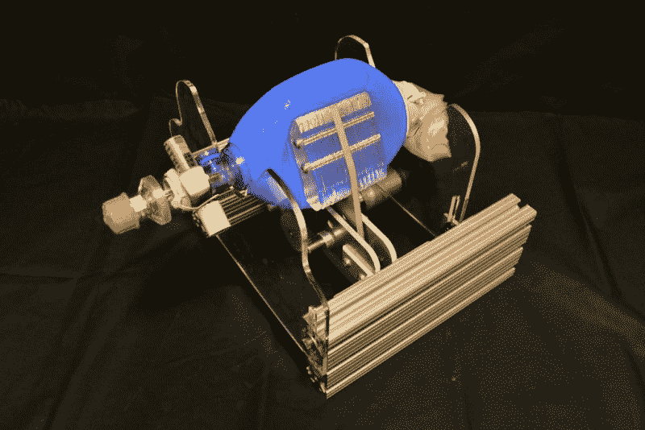
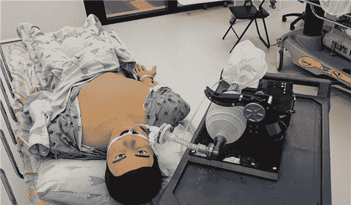
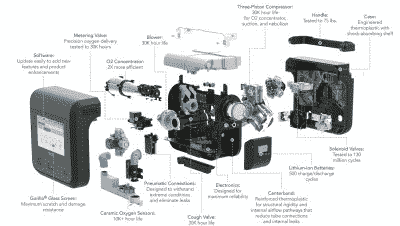

# 一个可靠的开源呼吸机是什么样子的？

> 原文：<https://hackaday.com/2020/04/09/what-does-a-dependable-open-source-ventilator-look-like/>

呼吸机是治疗冠状病毒最严重病例的关键。感染的指数增长和呼吸窘迫患者的数量已经超过了可用呼吸机的数量。在危机时刻，每个人都在寻找他们可以提供帮助的方法，而硬件社区做出回应的方法之一就是致力于一种可以快速制造以满足需求的通风机设计。

困难的事实是，治疗最严重的病人所需的呼吸机功能的复杂性使得自举设计难以置信地困难，并且我相信在这个时间线上不可能大量实现。尽管如此，一个设计良好且经临床批准的开源呼吸机可能会带来许多超越当前危机的好处。让我们来看看我们最近看到的一些努力，以及需要做些什么来完成一个完整的设计。

## 基于袋的呼吸机设计

[MIT E-Vent Design](https://e-vent.mit.edu/)

我们已经看到了许多基于气囊阀式面罩(BVM)的设计，也称为品牌名称 Ambu bag。你可能在电视上的医疗场景中见过这些，医务人员挤压一个大的柔性膀胱，将空气推入昏迷病人的肺部。许多最新的 DIY 设计都是通过自动挤压这种袋子来实现的。这做了 BVM 的工作，但我不愿意称之为呼吸机，因为它们缺乏许多关键特征。我将在下面解决这些问题，但也值得您花时间观看这段详细介绍该主题的 15 分钟视频:

 [https://www.youtube.com/embed/7vLPefHYWpY?version=3&rel=1&showsearch=0&showinfo=1&iv_load_policy=1&fs=1&hl=en-US&autohide=2&wmode=transparent](https://www.youtube.com/embed/7vLPefHYWpY?version=3&rel=1&showsearch=0&showinfo=1&iv_load_policy=1&fs=1&hl=en-US&autohide=2&wmode=transparent)

BVM 的使用最常见于短期情况，即肺部健康的患者需要维持生命，直到他们可以被转移到合适的呼吸机:想想 20 分钟的救护车车程。这些设备不是为长时间使用而设计的，我们已经看到[轶事报道称，新冠肺炎患者需要有创通气的时间比预期的长得多](https://www.bloomberg.com/news/articles/2020-02-23/coronavirus-patients-long-ventilator-stays-strain-hospitals)，超过一周，在某些情况下甚至长达数周。然后他们需要断奶回到他们身边。

这里看到的是由包括医生和工程师在内的志愿者组织在以色列开发的 AmboVent 设计。这是我们见过的最先进的包包设计之一，但它也引发了一些问题。当提供如这个插管的测试患者所示的有创呼吸支持时，空气需要被加热和加湿——通常是鼻窦的功能，鼻窦被绕过以将管子插入气管。目前还不清楚像这样的设计是否可以与外部加湿设备一起使用。

该设计也缺乏新冠肺炎病患者患病肺部所需的粒度。吸气和呼气周期都需要仔细地调节和监控，以确保尽可能多地使用肺部，并且不会对患者的肺部造成损害。虽然在这种特殊设计的软件中有一个压力传感器和“呼吸曲线”，但唯一的控制是电机控制的手臂挤压袋子的速度。也没有提供用于调节氧气浓度的内置机构。

其他类似的基于袋子的设计包括[麻省理工学院的 E-Vent](https://hackaday.com/2020/03/23/mit-ventilator-designed-with-common-manual-resuscitator-submitted-for-fda-testing/)使用桨挤压袋子，以及[英国的 ox Vent](https://oxvent.org/)将袋子放在一个小室中，使用压缩空气挤压袋子。所有这些设计都基于相似的原理，并具有相同的局限性。但迄今为止，最大的限制是传感器的缺乏和软件的复杂性。使用这些机器的病人被注射了镇静剂，通常会部分瘫痪。重症监护呼吸机能够感应气压、氧气浓度和呼吸频率，并快速准确地适应。开发这些功能对于一个仓促生产的产品来说是一场软件噩梦。由于缺少在许多可能的故障状态下发出警报的传感器，这些设计需要不间断的人工监督。

## 特斯拉的通风机原型更近，但仍然很远

特斯拉工程师上周展示的通风机原型肯定比基于袋子的设计更上一层楼。也就是说，使用急救包的巧妙之处在于，世界上所有的医院都有急救包。

 [https://www.youtube.com/embed/zZbDg24dfN0?version=3&rel=1&showsearch=0&showinfo=1&iv_load_policy=1&fs=1&hl=en-US&autohide=2&wmode=transparent](https://www.youtube.com/embed/zZbDg24dfN0?version=3&rel=1&showsearch=0&showinfo=1&iv_load_policy=1&fs=1&hl=en-US&autohide=2&wmode=transparent)

特斯拉设计的主要进步是氧气浓度和吸入/呼出压力的传感机制。正如视频中所展示的，有一个混合室，氧气在这里被添加到环境空气中。该系统可以根据呼气管道中的氧气浓度进行调节。吸气和呼气循环也有单独的压力传感和驱动。[急性呼吸窘迫综合征](https://en.wikipedia.org/wiki/Acute_respiratory_distress_syndrome) (ARDS)是治疗新冠肺炎患者的主要挑战之一，对这些独立压力的精细控制是治疗的关键组成部分。

这种有创通气再次绕过鼻窦，但由于这种设计依赖于泵而不是容量有限的压缩膀胱，因此它可能与外部加湿装置一起使用。如果这个系统被认为是可用的，它仍然需要被制造出来，这就提出了供应链可用性的问题，上一节提到的同样的“软件噩梦”将在这里出现。

## 现在我们有一个供应链问题，而不是设计问题

如果你对呼吸机很认真，你可以去看看鲍勃·巴德利的《呼吸机 101》。这篇杰作阐述了设计和制造这些先进机器的挑战。这些机器解决了与人体接口的真正困难的问题，我认为围绕它们的复杂性不可能有合适的捷径。好消息是我们已经设计、测试并广泛使用了它们。但是我们现在很难做出很多这样的*。*

*

Components in one of [Ventec’s ventilators](https://www.venteclife.com/)

所以我们现在的问题不是通风机的设计，而是制造供应链。很多人都在狂热地研究这个问题。这一集的[行星金钱播客跟随呼吸机活塞](https://www.npr.org/2020/03/31/824886286/episode-987-the-race-to-make-ventilators)的来源。通风机制造商 [Ventec 正与通用汽车](https://www.autoblog.com/2020/03/23/gm-ventec-ventilators-coronavirus-project-v-kokomo-indiana/)合作，后者正在加快供应链，生产数万台通风机，首批设备计划于本月投入使用。

我们现在极度短缺，情况真的很糟糕。希望这种供应链努力的意外收获将意味着这种设备的丰富。值得一提的是，我们最宝贵的资源不是设备，而是操作设备的医护人员。在我看来，尽我们所能支持他们并减少现在需要护理的人数是一个同样重要的问题。感谢这些冒着生命危险拯救他人的英雄们。

## 长期来看，开源呼吸机设计有意义吗？

如果在这一切开始的时候有一个开源的呼吸机设计会怎么样？当中国第一次出现严重病例时，情况会有所不同吗？这会对意大利、西班牙、欧洲和美国产生影响吗？再说一次，我们现在的问题是在供应链上。即使开放设计从一开始就准备好了，也很难说我们能够满足指数级的需求，因为类似的供应链问题也会出现。

然而，我确实认为与新设计相关的“软件噩梦”是开源非常适合的。当寻找像这样的短缺的解决方案时，一个经过严格审查、维护良好的开源软件栈将是一个强大的资产。

作为一个开源项目，硬件方面的事情有点难以想象，因为项目的贡献者需要能够复制硬件——这是所有开放硬件项目都面临的问题。这不是不可能的，但是维护一个广泛可用的物料清单是非常具有挑战性的。然而，有了机械图纸、CAD 文件、全面的规范和一流的测试制度，危机时刻的任务就变成了围绕供应链中特定缺口的工程设计，而不是完美地复制设计。

维护设计也是至关重要的。今天制造的设备在不进行重大重新设计的情况下，十年后还能生产吗？这些特性在十年后还能满足我们的需求吗？开源软件是强大的，但是弃用软件就没那么强大了。开源社区有许多成功的故事，当维护者把火炬从一个传递到下一个时，项目就能长寿。

简单来说，开源就是人，如果社区还在，项目也在。

## 新冠肺炎以外地区对通风机的需求

我们面临的一个主要问题是，呼吸机是一种低容量的医疗产品。洗衣机比换气扇多得多，而且洗衣机很便宜。人们对洗衣机的需求越来越频繁，如果它们不能正常工作，后果只是一堆洗不干净的衣服。当你小批量生产救生设备以满足严格的监管标准时，价格最终会非常高。开源项目不像 beer 那样免费——构建原型并获得认证需要时间和资源。但是一旦设计完成，就可以免费使用。如果设计能够满足安全标准，大规模生产的潜力是一个令人振奋的概念。

我很难过地得知[尼日利亚 200，000，000 人口中有大约 500 台呼吸机](https://www.ghanaweb.com/GhanaHomePage/africa/Nigeria-has-less-than-500-ventilators-for-Coronavirus-patients-Sources-903091)。相比之下，美国[的人口为 3.3 亿](https://heavy.com/news/2020/03/there-arent-going-to-be-enough-ventilators-in-time/)，人口约为 16 万。在这样的危机时刻，我们需要一个合理的系统来跨越国界和海洋共享设备和人员。我已经看到一些迹象表明，这种情况正在发生[，俄勒冈州](https://www.cnn.com/world/live-news/coronavirus-pandemic-04-04-20/index.html)和加利福尼亚州[向纽约州](https://www.latimes.com/california/story/2020-04-06/california-loans-500-ventilators-to-new-york-other-areas-in-immediate-need-amid-coronavirus)出借呼吸机，有望填补缺口，直到前面提到的那些新的呼吸机供应链获得回报。我希望这种分享将会加速并扩展到所有需要的地区。

一旦危机过去，作为开放设计出版的救生工具可能是提高可用性的一条途径。考虑到尼日利亚的人口，我觉得它的通风机数量很少。处于这种情况下的国家可以利用可靠的、经过测试的开源设计，开展自己的制造项目来增加供应吗？这是我想看到的未来。*